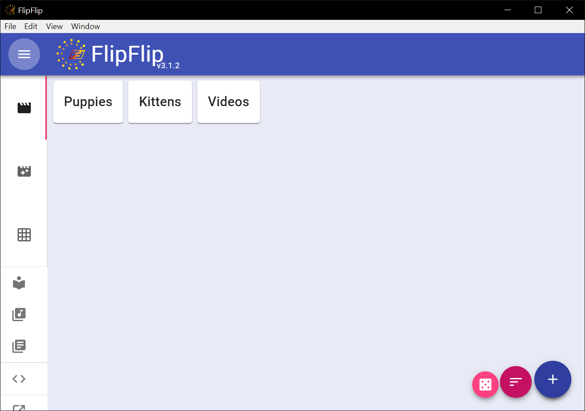

  

  <h3>FlipFlip</h3>
  A glorified slideshow, with <i>lots</i> of bells and whistles

## Links

* **[Download Latest Release (Mac/Windows/Linux)](https://github.com/ififfy/flipflip/releases/latest)**
* **[User manual](https://ififfy.github.io/flipflip/)**
* **[Subreddit](https://www.reddit.com/r/flipflip/)**

## Features
- Local files + Tumblr, Reddit, Twitter, Instagram, Imugr, DeviantArt & More!
- Animated GIF and Video support
- Visual Effects (Fade, Zoom/Transition, Strobe/Pulse, Overlay)
- Library and tagging to organize your sources and generate scenes
- Caption scripting support
- Easy to share!

## Quick start

Check out our [quick start](https://ififfy.github.io/flipflip/#/quickstart) guide.

## Contributing

Create a new branch, make your changes, and open a pull request. The policy of the FlipFlip project is, 
"patches are generally accepted." See the [developers](https://ififfy.github.io/flipflip/#/developers) 
documentation to get started.