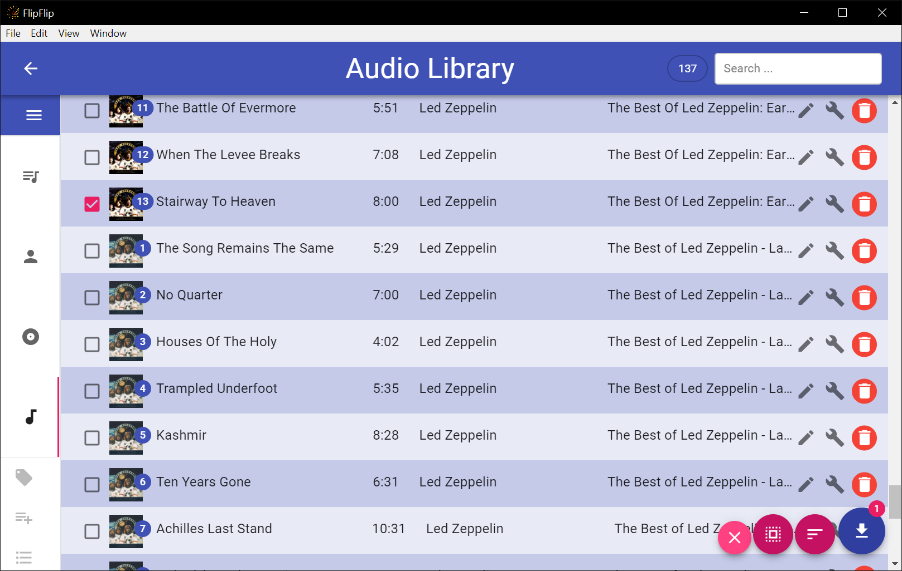

# Importing Audio Library Tracks into a Scene
To import Audio Library tracks into a Scene, first make a new playlist from the Audio Card by clicking the `+` in the 
top right of the card, and then click the `+` in the new playlsit to add a track from your library. This will bring you 
to a view of your Library with checkboxes next to each track. You can filter and sort this list to assist with locating 
specific files. After you're done selecting the tracks you want, click the `Import` button 
(  ). 
Your selected tracks will now appear in the playlist. Tracks are added in the order they were selected.

?> **Tip**: Use the _SHIFT_ key to quickly select multiple tracks

