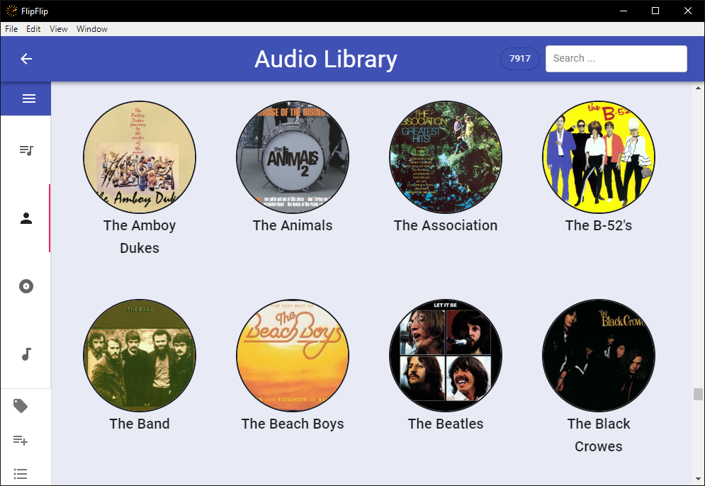
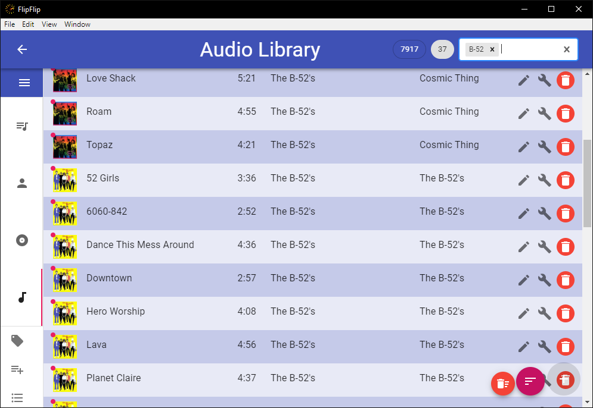
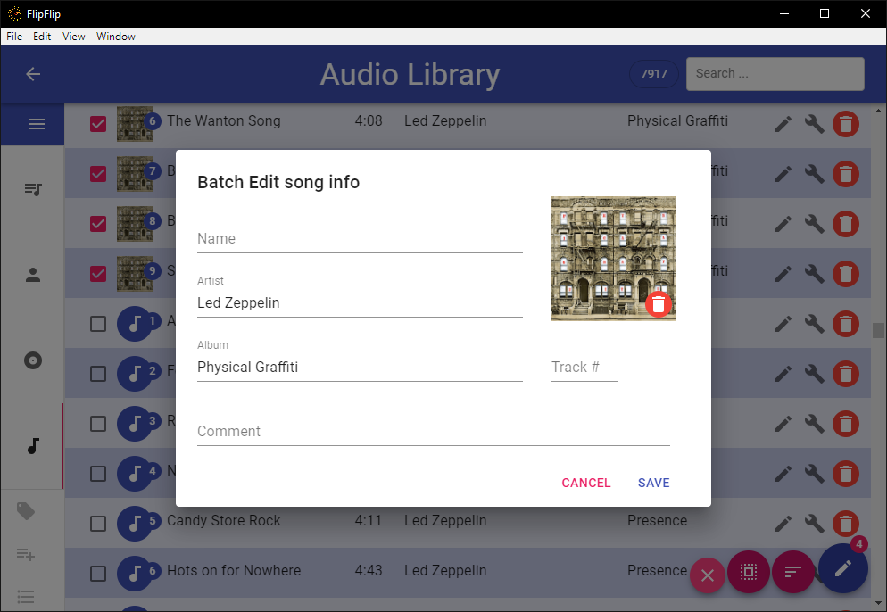

# Audio Library
The **Audio Library**, like the regular Source [Library](library.md), is a place for you to collect and manage all your 
audio tracks. To access the Audio Library, just click the `Audio Library` icon in the Scene Picker (Home) sidebar 
(  )

## Adding Tracks
Add new tracks by going to the **Songs** tab and clicking the plus-sign in the bottom right. You can add tracks locally
from your computer, or by entering a URL of an audio track.

## Search/Filter
Use the search bar to help find or filter the displayed items. Tags appear with a number indicating how many of 
the displayed tracks have that tag.

* Click on the search bar and select a tag, `<Marked>`, or `<Untagged>`.
  * Start typing to find a particular tag.
  * `<Marked>` shows only tracks that have been [marked](#marking-sources).
  * `<Untagged>` shows only tracks which have no tags.
* Type any term and press "Enter" or "Search for ___" to search. This is not case-sensitive.
  * Default audio search includes **url**, **name**, **artist**, and  **album** metadata.
* Type a phrase surrounded by `"` and `"` to search that exact phrase.
  * By default -- without this option, FlipFlip splits separate words into separate search terms.
* Type a tag surrounded by `[` and `]` to search by tag.
* Type `artist:` and then any term to search only the  **artist** field.
* Type `album:` and then any term to search only the  **album** field.
* Type `comment:` and then any term to search only the  **comment** field.
* Type `-` and then any term or filter to _exclude_ those tracks.
* Type `count>NUM`, `count<NUM`, or `count=NUM` to query based on the number of times a track has been played.
(Replace "NUM" with a number).

## Marking Sources
Users may wish to visually highlight certain items. To do this, search/filter the displayed tracks until they are 
the ones you wish to highlight, and then press **Alt+M**. These tracks will be marked with a dot in the top-left, and 
will remain that way after the search/filter is cleared. This may be useful for keeping track of a set of tracks you 
are working on (for instance new tracks you are editing or tagging). 

## Batch Edit
To begin batch editing, click the `Batch Edit` button (  ) in the sidebar. This will provide a checkbox 
next to each visible source. Select the tracks you would like to batch edit and click the `Edit` button in the bottom 
right (  ). You 
will be presented with a pop-up and fields for entering track metadata. Values shard by your selected tracks wil be 
automatically populated.

?> **Note:** Data entered in the "Comment" field (and track tags) can be viewed by mousing over a track's Avatar.

?> **Tip**: Use the _SHIFT_ key to quickly select multiple sources

## Playlists
You can also make playlists directly within the Audio Library. To make a playlist, click the `Add to Playlist` button 
(  ) in 
the sidebar. This will provide a checkbox next to each visible source. Slect the tracks you would like to add to a 
playlist and click the `Add to Playlist` button in the bottom right 
(  ).
Select a playlist from the list or click `+ New Playlist`. When making a new playlist, simply enter the name of your 
playlist and select `Create Playlist`.

?> **Note:** Playlists must have unique names

## BPM Detection
You can have FlipFlip automatically detect the BPM of your library tracks, rather than having to do it for each 
individual track. To start this process, click the `BPM Detection` button in the sidebar
(  ). While 
this process is running, a progress bar will appear in the sidebar.

## Delete Source Content
Sometimes, you may want to be able to totally delete a track from your file system. To do this, **Shift+Ctrl+Alt+Click**
the track's avatar icon. You will be prompted to confirm this choice, after which the track in FlipFlip and the file
on your system will be deleted.

?> **Note**: This can only be done for local tracks