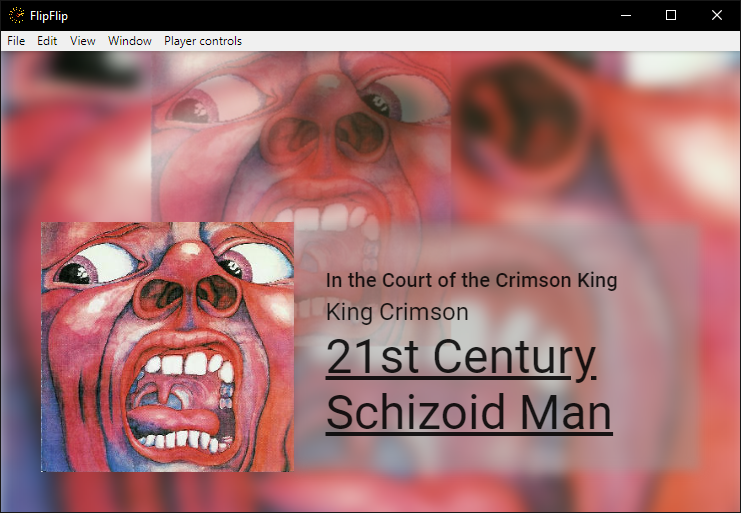
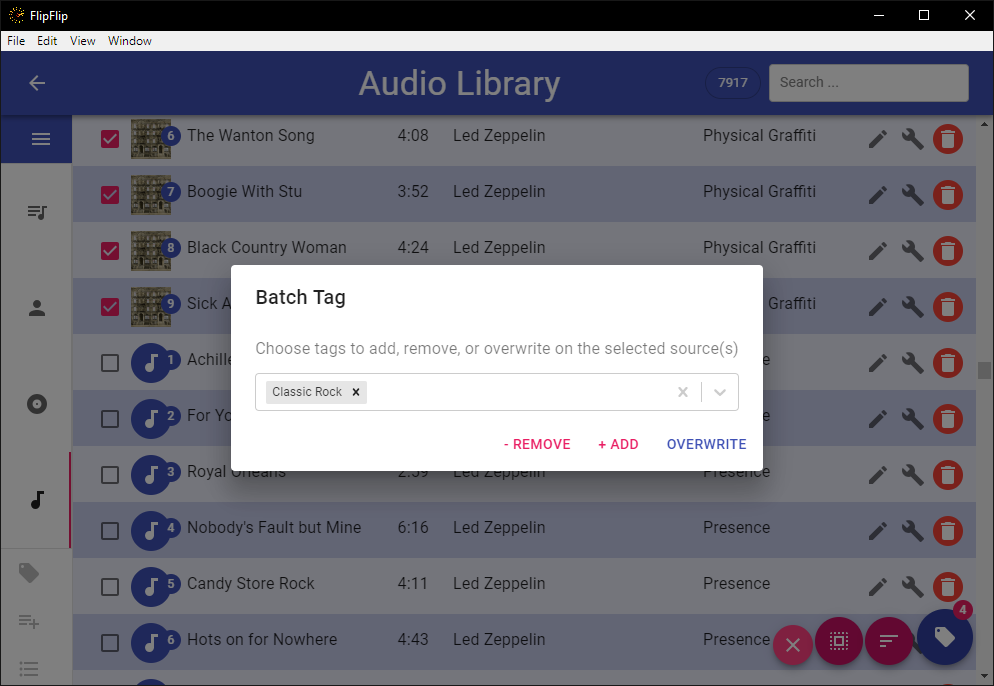

# Tagging
While there is not yet a way to use tags to generate audio playlists, they are still helpful for managing your tracks
and finding what you're looking for.

The first step is to add some tags. Click the `Manage Tags` button (  ) in the sidebar. See [Manage Tags](tagging.md#manage-tags)
for more information about adding tags.

?> **Note**: Tags are shared between regular sources, audio tracks, and caption scripts.

## Tagging a track
To tag a track in the Library, click the track's Avatar. This will start a Scene with an audio playlist, starting at 
the selected track. To modify the tags, hover towards the bottom of the screen, and you will see your tags appear. 
Toggle tags on/off as desired by clicking on them. When you're done, click "Back" to return to the Library.

While Tagging, use `[` and `]` to skip to the previous/next visible track in the Library. 

## Audio Info
If "Show Audio Info" is enabled in FlipFlip Settings, track information will apear for about 8 seconds whenever a
track chages.

## Batch Tagging
To begin batch tagging, click the `Batch Tag` button (  ) in the sidebar. This will provide a checkbox 
next to each visible track. Select the tracks you would like to batch tag and click the `Tag` button 
(  ). You 
will be presented with a pop-up and a number of options.

* Select tags and click `Overwrite` to force each selected scene to match those tags
* Select tags and click `- Remove` to remove those tags from each selected scene.
* Select tags and click `+ Add` to add those tags to each selected scene.

?> **Tip**: Use the _SHIFT_ key to quickly select multiple sources

