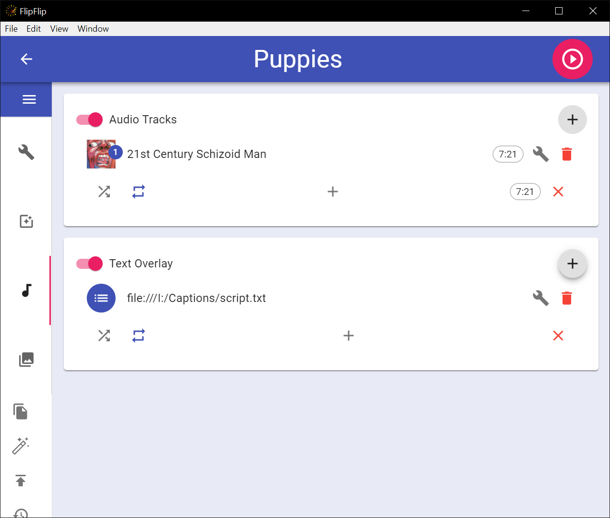
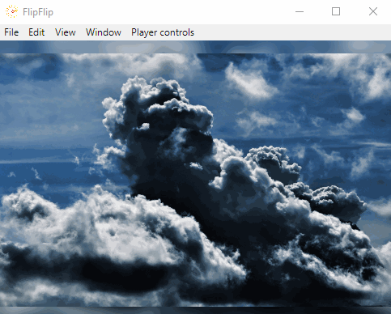

# Audio/Text
The **AUDIO/TEXT** tab controls audio and text overlays.

## Audio
This card allows you to layer multiple audio track playlists over your Scene. Each playlist, a sequence of 
consecutive tracks, begins playing when the scene starts.

In order to add tracks to your scene, you will first need to add them to your [Audio Library](audio_library.md).

Once you have tracks in your library to import, you can add a playlist by clicking the + button in the top right corner. 
Then, click the + in the middle of the new playlist to [import tracks from your library](audio_import_from_library.md) 
to this playlist. 

Imported tracks will still have the same playback options as those in your library, but can be changed independently 
within this scene, without effecting your library's options. You drag and drop tracks to re-order them.

Click the wrench to change the following options for a track:
* **Volume** - Control the volume of this track.
* **Tick** - The audio file will play/restart at a certain interval.
  * Control tick timing options.
* **Stop at End** - The Scene will stop when the audio track ends.
* **Next Scene at End** - The Next Scene will play when the audio track ends.
* **Speed** - Control the playback speed of this track.

FlipFlip can use the BPM of the audios in the **first playlist** for timing the scene or effects. You can either (1) enter this 
value manually, (2) try to detect the BPM of the entered audio file, or (3) read the BPM from the ID3 metadata of the 
entered audio file.

## Text
This card allows you to layer multiple caption playlists over your Scene. Each playlist, a sequence of
consecutive scripts, begins playing when the scene starts.

In order to add scripts to your scene, you will first need to add them to your [Script Library](script_library.md).
This can be a local file or a remote URL.

Once you have scripts in your library to import, you can add a playlist by clicking the + button in the top right corner.
Then, click the + in the middle of the new playlist to [import tracks from your library](script_import_from_library.md)
to this playlist.

Scripts must follow the [caption script format](caption_script.md).

Click the wrench to change the following options for a track:
* **Stop at End** - The Scene will stop when the caption script ends.
* **Next Scene at End** - The Next Scene will play when the audio track ends.
* **Sync Timestamp with Audio** - When enabled, timestamps in this script will be synced with the currently playing audio (if there is any). Disable this to unsync your script's timestamps.
* **Font Options** - You can select the font family, size, and color as well as border width and color for each of action command

