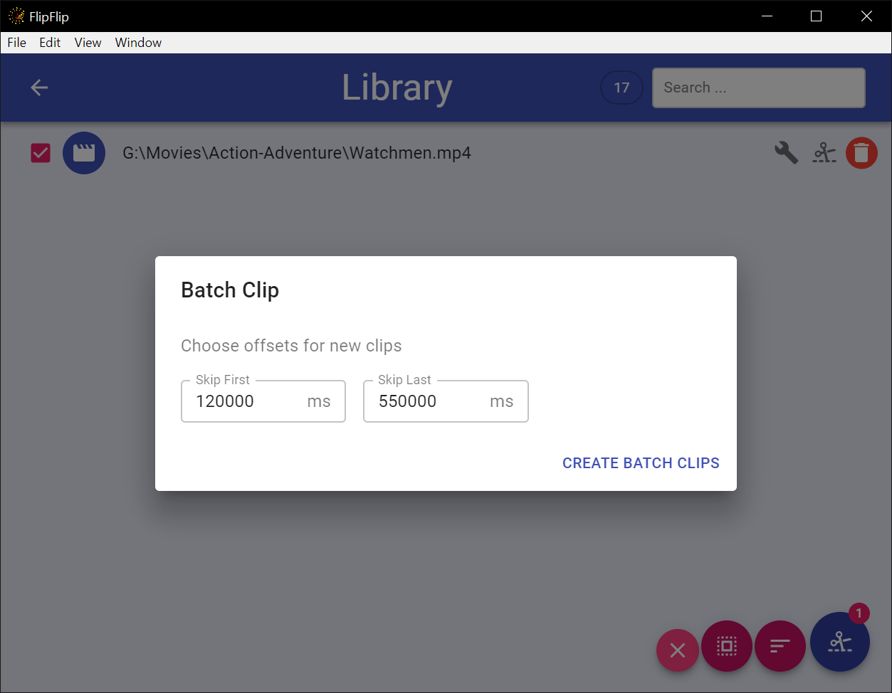

# Video Clipper

Often, you may only want to play _part(s)_ of a video rather than the whole thing. Rather than being forced to edit
each video, the "Video Clipper" allows you to curate "clips" from a video source which you can opt to use in your scenes.

To get started, create a video source (either in a Scene or in the Library). **NOTE:** This **_MUST_** be a direct
video URL (local or remote). 

Then, click the  
next to the source to go to the "Video Clipper" interface:

To create a new clip, click the `+`. To edit/view an existing clip, just click its number.

A slider will appear allowing you to select the start and end of this clip. You can also enter/modify the timestamp
directly for more precise selection. Double click `Start` or `End` to set it to the player's current timestamp. Use ↑/↓
keys to move the selected timestamp up/down 1 second.

* Click  to save changes to 
this clip.
* Click  to start tagging this clip.
  * New clips will ineherit the source's current tags.
  * Chaging a source's tags doesn't change its clips' tags.
  * Clip tags will be used for Scene Generators which have `Use Clips` on, otherwise source tags will be used
    * If a clip has _no_ tags, it acts as though it has its source's tags during Scene Generation.
* Click  to set the volume
of this clip to the current volume. Right click to reset the volume.
  * This volume level will take priority over a Scene's "video volume" level.
  * Clips without a set volume will use the Scene's "video volume" level.
* Click  to remove this clip.
  * _This only appears for saved clips._
* Click  to cancel changes.

While Clipping use Space to play/pause and use ← → to jump back/foward in 10sec intervals. Use `[` and `]` to jump to 
Clipping the previous/next visible video in the Library.  

?> Note: If clips don't seem to be working during playback, ensure that "Use Clips" is enabled for your scene (otherwise, 
it will play from the entire video). 

## Batch Clipping
To begin batch clipping, click the `Batch Clip` button (  ) in the Library sidebar. This will provide a checkbox
next to each visible source. Select the sources you would like to batch tag and click the `Clip` button
(  ) in the bottom 
right. You will be presented with a pop-up.

* Enter values for `Skip First` and `Skip Last`
  * `Skip First` is how far into the video the clip should start
  * `Skip Last` is how far before the end the clip should stop
* Click `Create Batch Clips`
  * One (1) clip will be created for each of the selected video files using the given times

?> **Tip**: Use the _SHIFT_ key to quickly select multiple sources

