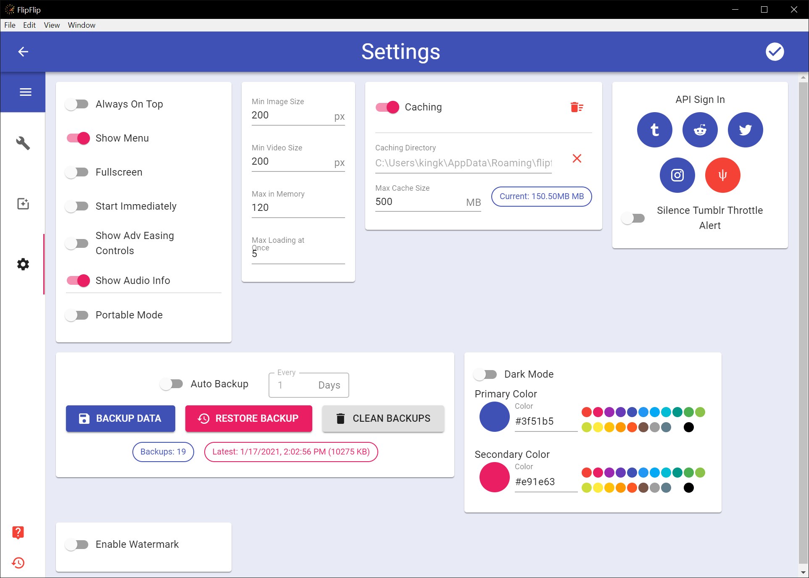

# Settings
The main purpose of Settings is to configure defaults for new Scenes (You cannot set default Audio or Text). 
Some other General Settings exist to help customize your FlipFlip experience. To access the Settings page, click the 
`Settings` icon ( 
 ) in the Scene Picker
(Home) sidebar.

When you are done making changes to the Settings, click the `OK` button (  ). Settings will only be saved if they are valid.

## Scene Default Option/Effects
Configure default settings for each Scene just like you would in the Scene itself. These preferences will be applied 
whenever you create a new Scene (or Generator). These defaults can also be applied to any existing Scene by clicking the 
"Restore Defaults" button in the Scene's sidebar.

## Player Settings
These settings control various player options.

* `Always On Top` - keep Player on top of other windows
* `Show Menu` - show menu bar while playing
* `Fullscreen` - display player in fullscreen mode
* `Start Immediately` - don't wait for full scene to load, start as soon as first image loads
  * _Be aware this may cause the beginning to be janky, while the sources continue loading_
* `Show Adv Easing Controls` - enables controls for advanced [easings](effects.md) in effects
* `Show Audio Info` - when enabled, [audio information](audio_tagging#tagging-a-track) will appear during playback when a track changes.
  * _This only ever applies to the first playlist_
---
* `Confirm Scene Delete` - Disabling this will hide the confirmation dialog when deleting a Scene.
* `Portable Mode` - Portable Mode will save a copy of your data in the same directory as the FlipFlip executable, 
as well as the default save path. This needs to be enabled on each machine.
  * `Disable Local Saves` - When this is on, FlipFlip will _only_ save its data to the folder with the FlipFlip 
    executable and _will not_ save to the default save path.
---
* `Min Image/Video Size` - the minimum number of pixels each dimension of an image/video must be 
(default: 200 - image's width _and_ height must be larger than 200px).
* `Max in Memory` - the maximum number of images to keep in history (navigating backwards and forwards).
  * Images in memory/history are cleared when the slideshow is stopped.
* `Max Loading at Once` - the number of threads to have loading images.
  * _Be cautious increasing this number as this will increase processing and may degrade performance._

## Caching
These settings control the caching abilities of FlipFlip. By default, FlipFlip caches 500MB of images in the 
`appData` directory. However, you can customize the caching dir and max size by changing values here. 
Turning caching off will prevent FlipFlip from reading from or writing to the cache.

## API Keys
These settings control how remote sources are used. 

### Tumblr
By default, Tumblr API keys are provided. However, if you are experiencing 429 responses from Tumblr, you may replace 
these with your own API keys to improve performance. Instructions for getting your own API key are [here](tumblr_api.md). 

In order to import your Tumblr Following, you must first activate FlipFlip with your account. You should only ever 
have to do this once.

Tumblr has no Read-Only mode, so read AND write access are requested. FlipFlip does not store any user information or 
make any changes to your account.

* Click the `Tumblr` icon
* Click `OK` on the confirmation dialog
* You will be directed to Tumblr.com in your browser
* Click `Allow` to give FlipFlip read permission
* Go back to FlipFlip
* You should see a Success! message

?> Enable **Silence Tumblr Throttle Alert** to prevent FlipFlip from alerting you when Tumblr starts returning 429 responses.

### Reddit
In order to use Reddit Subreddits/Users as sources or import your Subscriptions, you must first activate FlipFlip 
with your account. You should only ever have to do this once.

FlipFlip does not store any user information or make any changes to your account.

* Click the `Reddit` icon
* Click `OK` on the confirmation dialog
* You will be directed to Reddit.com in your browser
* Click `Allow` to give FlipFlip read permission
* Go back to FlipFlip
* You should see a Success! message

### Twitter
In order to use Twitter Profiles as sources or import your Following, you must first activate FlipFlip with your 
account. You should only ever have to do this once.

FlipFlip does not store any user information or make any changes to your account.

* Click the `Twitter` icon
* Click `OK` on the confirmation dialog
* You will be directed to Twitter.com in your browser
* Click `Allow` to give FlipFlip permission
* Go back to FlipFlip
* You should see a Success! message

### Instagram
In order to use Instagram Profiles as sources, you'll need to provide your username and password.

FlipFlip does not store any user information or make changes to your account. Your login information is stored locally 
on your computer and is never shared with anyone or sent to any server (besides Instagram, obviously).

* Click the `Instagram` icon
* Enter your Username and Password
* Click `Authorize FlipFlip on Instagram`
* You should see a Success! message

### Hydrus
In order to use a Hydrus server for sources, you'll need to provide the serve details. This includes protocol 
(`http` vs `https`), domain, port, and API Key.

?> You can only have **one Hydrus server** configured at a time.

FlipFlip does not store any user information or make changes to the server. Server information is stored locally
on your computer and is never shared with anyone or sent to any server (besides Hydrus, obviously).

* Click the `Hydrus` icon
* Enter the server's protocol, domain, port, and API Key.
* Click `Configure Hydrus`
* You should see a Success! message
  * If you see an error message, FlipFlip was not able to establish connection to the server.

## Backup
Backup your FlipFlip data or restore from a previous backup.

#### Auto Backup
Turn this on to automatically create a backup every time the number of configured days passes.

#### Auto Clean
Turn this on to automatically clean backups according to the configured settings. Will keep 1 backups from each of the
configured time-periods.

#### Backup Data
This creates a backup with all your current FlipFlip data (preferences, library, scenes, etc.)

#### Restore Backup
A dialog will appear with a list the your FlipFlip backups (by date/time). Select the backup you wish to 
restore and click `Restore`

#### Clean Backups
Backups might build up over time. Click `Clean Backups` to clean your backups. If you have Auto-Clean enabled, this will
use your configured rules. If Auto-Clean is off, you can choose how many of the most recent backups you'd like to keep.

## Theme
The FlipFlip UI allows you to customize the **Primary** and **Secondary** colors. You can also toggle Dark Mode on/off here

## Watermark
Enabling this will display a custom watermark during FlipFlip playback. In addition to the watermark text, you can also
select which corner it appears in, as well as font family, size, and color.

You can include the following special variables in your watermark text, and they will be automatically replaced 
with the relevant information:

| Variable Code    | Replaced By                                         |
|:----------------:|:---------------------------------------------------:|
| `{scene_name}`   | Name of the current **Scene**                       |
| `{source_url}`   | URL of the current **Source**                       |
| `{source_name}`  | Name of the current **Source**                      |
| `{file_url}`     | URL of the currently displayed **File**             |
| `{file_name}`    | Name of the currently displayed **File**            |
| `{audio_url}`    | URL of the currently playing **Audio**              |
| `{audio_name}`   | Name of the currently playing **Audio**             |
| `{audio_title}`  | Title (metadata) of the currently playing **Audio** |
| `{audio_artist}` | Arist (metadata) of the currently playing **Audio** |
| `{audio_album}`  | Album (metadata) of the currently playing **Audio** |

?> A source/file/audio "Name" is the shortened name parsed from the full "URL". (e.g. `https://www.reddit.com/r/AnimalsBeingDerps/` becomes `AnimalsBeingDerps`)