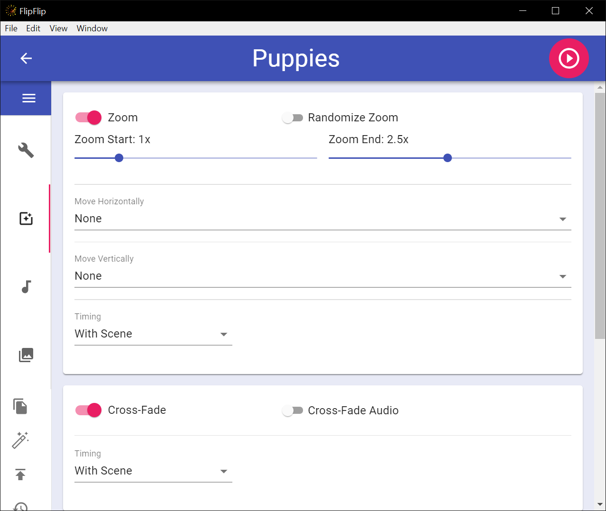
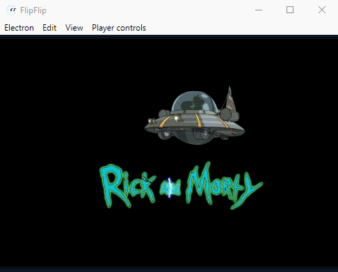
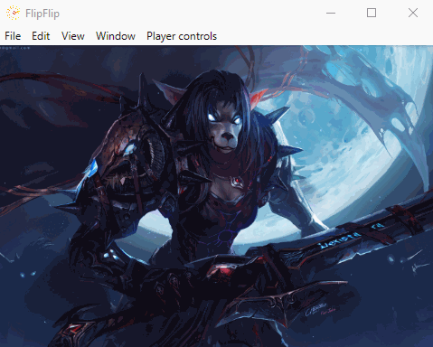
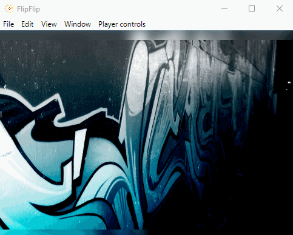
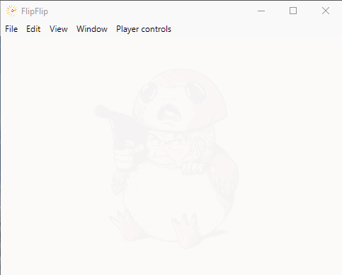
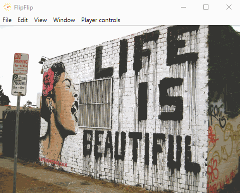

# Effects
The **EFFECTS** tab controls the various image effects: **Zoom/Move**, **Cross Fade**, **Strobe**, **Fade In/Out**, 
and **Panning**.

FlipFlip effects all share the same types of timings (in ms):
* **Constant**: Occurs at a set interval
* **Random**: Occurs at a random interval between min & max (ms)
* **Wave**: Occurs at sin wave between min & max (ms).
  * You can modify the rate of change as well. _95-100 is generally recommended_ 
* **BPM**: Occurs at the rate of the BPM of the first audio file
  * You can change the BPM multiplier to increase/decrease this rate.
* **With Scene**: Occurs when the image changes

?> Advanced users may want to control the **_easing_** of these effects. To enable easing controls, 
visit [Settings](config.md#player-settings) and enable "Show Adv Easing Controls". A list of easings will appear 
below each effect configuration. Refer to [these graphs](https://github.com/d3/d3-ease#api-reference) for detailed 
information about what each easing type does.

## Zoom/Move
This section controls image movement. This effect restarts when the displayed image changes.
* Choose zoom on/off. Control start/end scale and randomization.
* Choose move horizontally left/right/either (or none). Control distance (%) and randomization.
* Choose move vertically up/down/either (or none). Control distance (%) and randomization.
* Control zoom/move timing options.

    

        

        
Using the default Linear easing

    

    

        

        
Using the <b>Back Out</b> easing

    

## Crossfade
This section controls fade effects.  This effect restarts when the displayed image changes.
* Choose whether to cross-fade images/video.
* Choose whether to cross-fade audio when cross-fading video.
* Control cross fade timing options.

    

        

        
Using the default Linear easing

    

    

        

        
Using the <b>Exp In</b> easing

    

## Strobe
This section controls the strobe effect.  This effect restarts when the displayed image changes.
* Choose strobe on/off. Control strobe time (ms).
* Choose delay on/off. Control delay time (ms).
* Control color(s). Choose single color, set of colors, or random colors.
* Control strobe layer. If at "Behind All", control opacity.

    

        

        
Using the default Linear easing

    

    

        

        
Using the <b>Exp In</b> easing

    

## Fade In/Out
This section controls the fade in/out effect. This effect is continuous and will continue even if the displayed image 
changes.
* Choose fade in/out on/off. Control fade in/out time (ms).
  * This time represents a full fade in/out (half fade in, half fade out)

    

        

        
Using the default Linear easing for both start and end

    

    

        

        
Using the <b>Poly In</b> easing for both start and end

    

## Panning
This section controls the panning effect. This effect is continuous and will continue even if the displayed image 
changes.
* Choose panning on/off.
* Choose panning horizontally from Left then Right/Right then Left/Random (or None). Control distance (%) and randomization.
  * Choose "Use Img Width" to only pan as far as the image reaches horizontally off-screen.
* Choose panning vertically from Up then Down/Down then Up/Random (or None). Control distance (%) and randomization.
  * Choose "Use Img Height" to only pan as far as the image reaches vertically off-screen.
* Control panning timing options.

    

        

        
Using the default Linear easing for both start and end

    

    

        

        
Using the <b>Linear</b> easing for start and the <b>Bounce Out</b> easing for end

    

