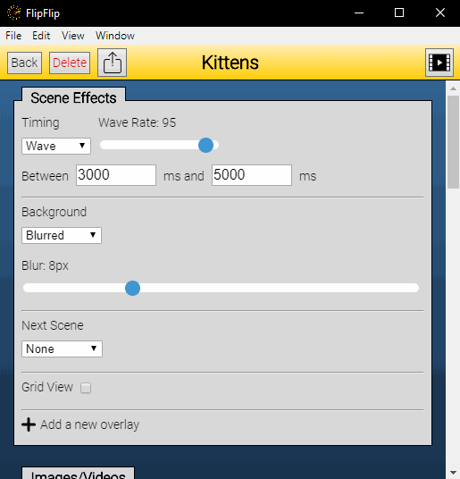

# Grid Setup

?> Note: This feature is in early beta and may not work as expected.

To play your scene in a grid, first make sure `Grid View` is checked, then click the `Setup Grid` button.

Start by changing the `Height` and `Width` at the top to match the dimensions you'd like. You will see the grid 
grow/shrink to match your selected size.

Now, start dragging your scenes into the grid spots. To remove a scene from the grid, just click it.

When you're done, click Save (you can only save a full grid).

Start your scene as normal and your grid should work:

 