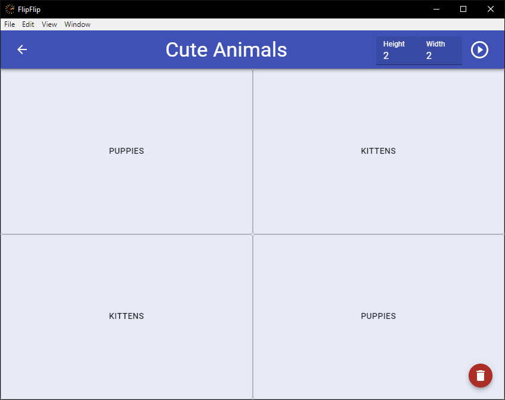
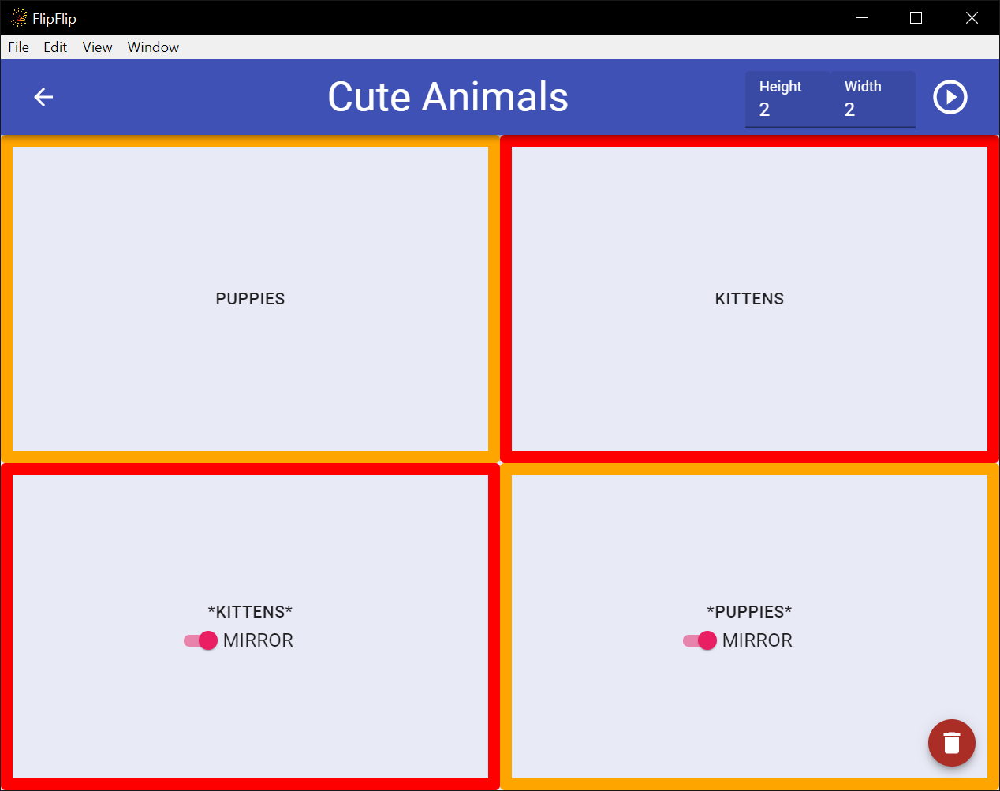

# Scene Grid

A Scene Grid allows you to play your Scenes simultaneously in a grid format. To make one, click the `+` from the
Scene Picker (Home) and select `Scene Grid`.

This is the main Grid Setup. In the top right, you can alter the height and width dimensions of the grid.

To edit a cell, simply click it, and select the Scene you want to be there. Alternatively you can leave a cell **EMPTY**

Start your scene as normal and your grid should work:

### Clone/Mirror Cells

You can also choose to clone/mirror grid cells so that playback is synced across them.

To clone a cell, first add a scene, then drag-n-drop it onto the other cell(s) you want it to be cloned to. You can
also choose to "mirror" that cell's playback (flip horizontally). Cloned cells will be color coded, so they can more
easily be identified.

?> Note: Playing a grid with many scenes may negatively affect the framerate of cloned videos. In order to
compensate, you can enable "Clone Grid Videos Directly" in [Settings](config.md). When enabled, cloned grid cells will
use a copy of the actual video file, instead of drawing each frame on a canvas. This may improve video framerate, but
will remove absolute synchronization.

