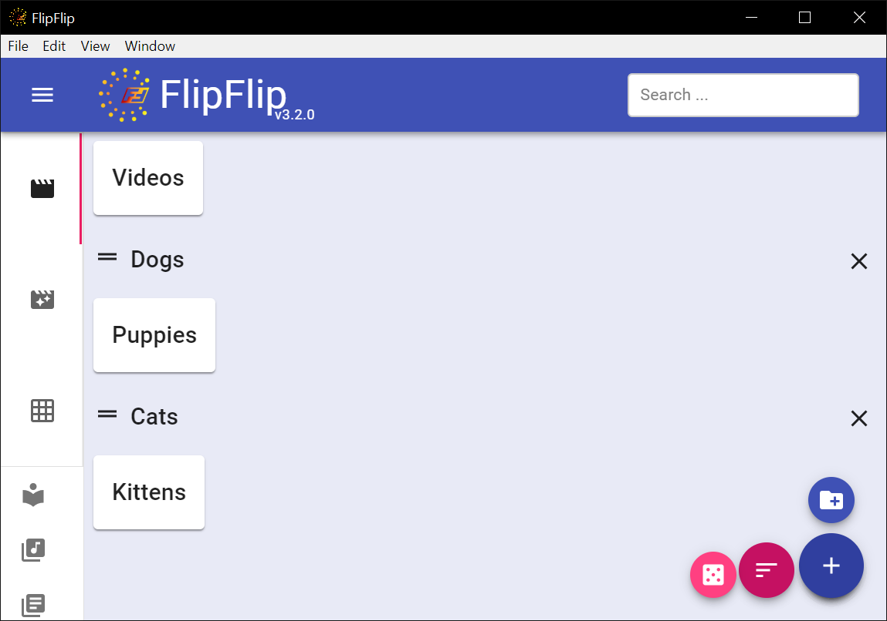

# Scene Groups

Scenes are already split up into tabs of (1) scenes, (2) scene generators, and (3) scene grids. However, you may 
want to group these into your own categories.

To create a Scene Group, go to the home page and click the tab you want to create a group for (scenes/generators/grids), 
then click the Add Group button (  ). 

You can drag-n-drop your scenes into, out of, and between groups, as well as reordering the groups themselves -- use the handles.

Click the X on the right to delete a group. Its scenes will simply return to the general pool.

