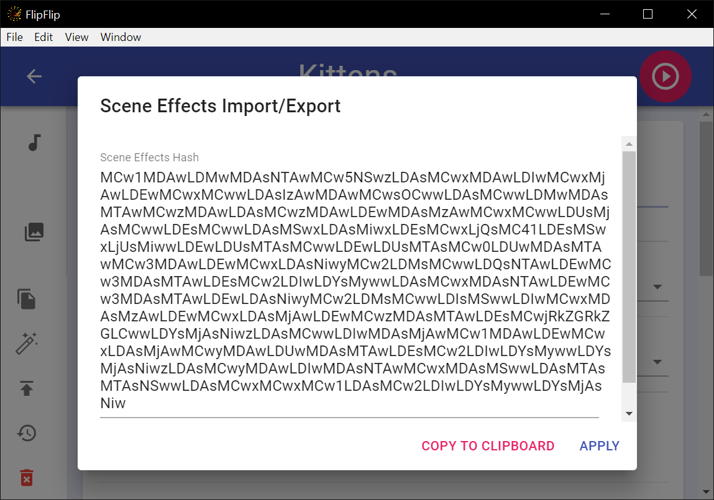
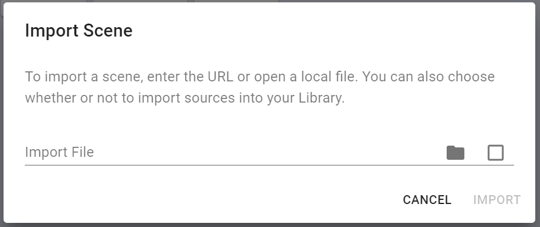

# Import/Export
Users may wish to share their scenes or even their entire library with others. FlipFlip makes it easy to 
export your resources and to import those you may receive or find!

## Scene Effects
To share the options/effects for a Scene _without_ the scene's sources, audio, or captions, open the Scene you want to 
use and click the `Scene Effect Import/Export` button (  )

?> This can also be helpful to quickly move options/effects between your own scenes.

### Export

To share your scene effects, simply click `Copy To Clipboard` and paste this text somewhere to share.

### Import

To apply effects, paste an effect hash into the text area and click "Apply". Your current effects will be overridden 
with those of the hash. This will not affect the scene's sources, audio, or captions.

## Full Scene Export
To export a Scene, open the Scene you want to export and click the `Export Scene` button ( 
 ) in the sidebar. 
Save the file and share where you'd like. This file is just a long line of text which holds the data about your 
Scene's full configuration.

If you'd prefer not to share the file itself, you can paste the contents of the export file onto a service like
[Pastebin](https://pastebin.com) or [Hastebin](https://hastebin.com), and then share the raw URL instead.

Any overlays will also be exported with this scene. However, those overlays' overlays will not be exported.

?> Scene Generators will be exported as regular Scenes.

?> **NOTE:** _Due to the nature of FlipFlip scenes, we don't recommend you try and import/export Scenes with local 
directories. This will technically work, but the import/exporter would have to have the same file paths (or will 
have to modify them manually)._

## Full Scene Import
To import as Scene, click the `+` and then `Import Scene`  (  ) on the Scene Picker (Home). You will be prompted to enter a URL or file to import from. 

* If you have a `.json` export file, click the `Open File` button to select it
* If you have a URL, paste it into the text field
  * URLs should be to the **raw** json file 

Mark the checkbox if you'd like to import this scene's sources, audios, and scripts into your libraries.

After you click `Import`, the imported Scene (and any overlays/grids) will be created.

## Library Export
To export your Library, click the `Export Library` button (  ) from the Library sidebar. Simply save the json file and share it as 
you'd like, or keep it as a backup. This file is just a long line of text which holds the data about your
Library's sources.

If you'd prefer not to share the file itself, you can paste the contents of the export file onto a service like
[Pastebin](https://pastebin.com) or [Hastebin](https://hastebin.com), and then share the raw URL instead.

## Library Import
To import a Library, click the `Import Library` button (  ) from the Library sidebar. You will be prompted to enter a URL or file to import from.

* If you have a `.json` export file, click the `Open File` button to select it
* If you have a URL, paste it into the text field
  * URLs should be to the **raw** json file

After you click `Import`, the sources from the library file will be imported. Sources you already have will not be 
duplicated. However, if the imported Library has tags for a source and you do not, the tags will be imported. The tags 
for any new items will be created and added. Any new blacklist urls or clips will be added to existing sources.

