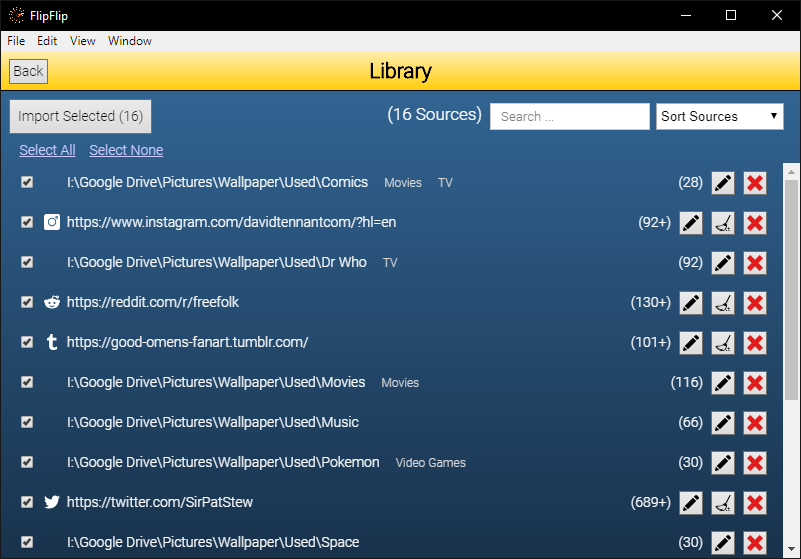

# Importing Library Sources into a Scene
To import Library sources into a Scene click the `+` and then `From Library` from the Sources tab. This will 
bring you to a view of your Library with checkboxes next to each source. You can filter and sort this list to assist 
with locating sources. After you're done selecting the sources you want, click the `Import` button ( 
 ). 
Your selected sources will now appear in the scene.

?> **Tip**: Use the _SHIFT_ key to quickly select multiple sources

