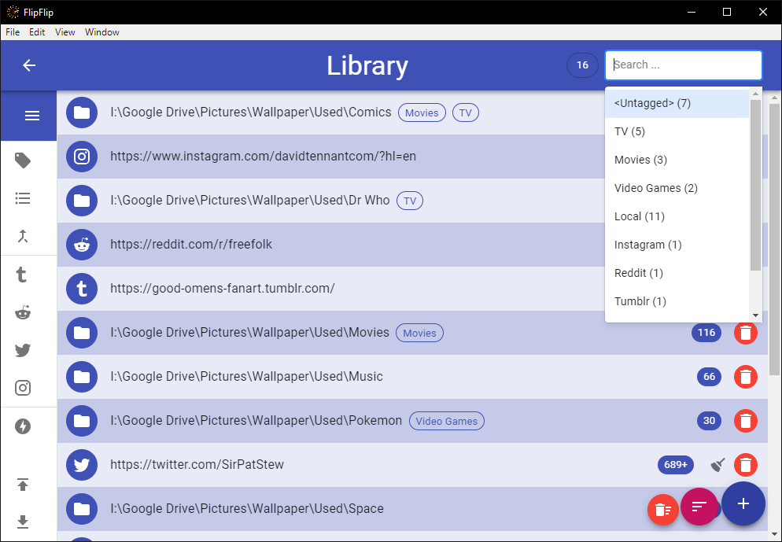
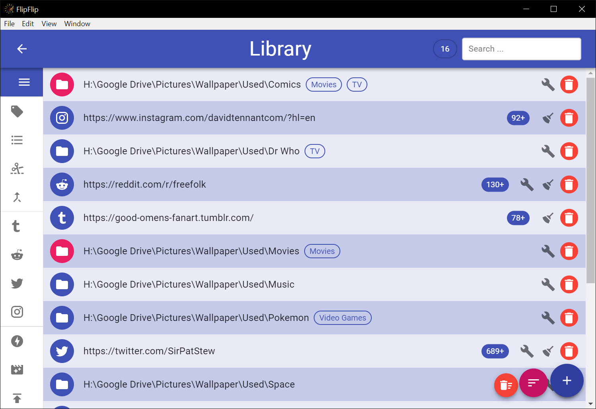
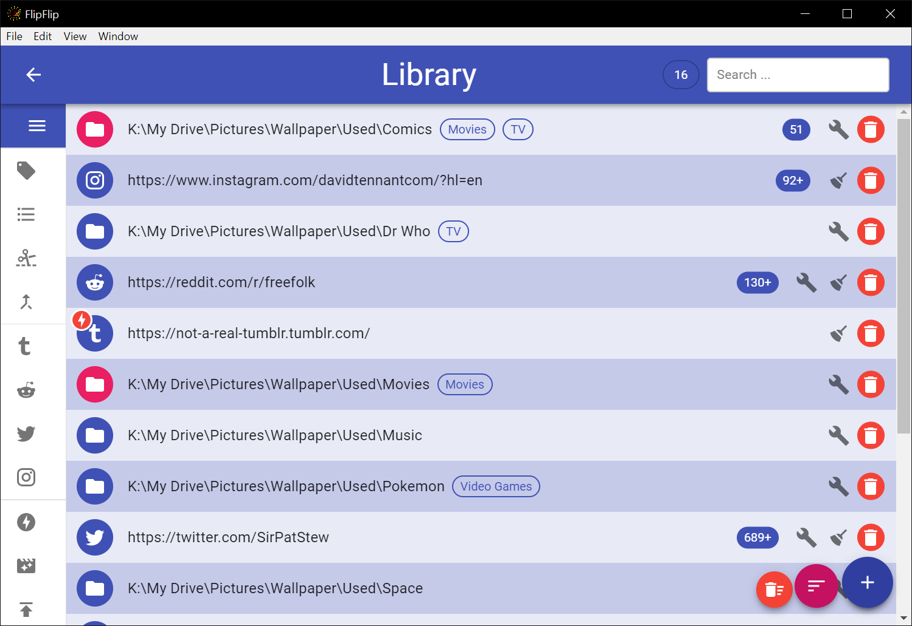

# Library
The **Library** is a place for you to collect and manage all your sources. To access the Library, just click the `Library`
icon in the Scene Picker (Home) sidebar (  )

## Adding Sources
Sources are added to the Library and sorted just like in a [Scene](sources.md#modifying-sources).

## Search/Filter
Use the search bar to help find or filter the displayed sources. Tags/Types appear with a number indicating how many of 
the displayed sources have that tag/type.

* Click on the search bar and select a tag, type, `<Offline>`, `<Marked>`, or `<Untagged>`.
  * Start typing to find a particular tag/type.
  * `<Offline>` shows only sources that have been determined to be offline by [Mark Offline](mark_offline.md).
  * `<Marked>` shows only sources that have been [marked](#marking-sources).
  * `<Untagged>` shows only sources which have no tags.
* Type any term and press "Enter" or "Search for ___" to search. This is not case-sensitive.
* Type a phrase surrounded by `"` and `"` to search that exact phrase.
  * By default -- without this option, FlipFlip splits separate words into separate search terms.
* Type a tag surrounded by `[` and `]` to search by tag.
* Type a type surrounded by `{`` and `}` to search by type.
* Type `-` and then any term or filter to _exclude_ those sources.
* Type `count>NUM`, `count<NUM`, or `count=NUM` to query based on source counts. (Replace `NUM` with a number).
  * This _**excludes**_ counts that are incomplete (still showing "+").
  * To _**include**_ incomplete counts, type `count+>NUM`, `count+<NUM`, or `count+=NUM`.
* Type `duration>TIMESTAMP`, `duration>TIMESTAMP` or `duration=TIMESTAMP` to query based on video durations. (Replace
  `TIMESTAMP` with a valid timestamp or simply the number of seconds).
  * This only applies to video sources which have had their metadata detected.
* Type `resolution>RESOLUTION`, `resolution>RESOLUTION` or `resolution=RESOLUTION` to query based on video resolutions.
  (Replace `RESOLUTION` with a number).
  * This only applies to video sources which have had their metadata detected.

## Marking Sources
Users may wish to visually highlight certain items. To do this, search/filter the displayed sources until they are 
the ones you wish to highlight, and then press **Alt+M**. These sources will be colored differently and will remain that 
way after the search/filter is cleared. This may be useful for keeping track of a set of sources you are working on 
(for instance new sources you are tagging). 

## Find Mergeables
When you have a large number of local directories, it may be helpful to find those which share the tags so that you can
merge them together. To do this, click `Find Mergeables` (  ) in the sidebar. You will then see a list of
local sources sorted into sets. Each set shares the same tags and could each (in theory) be merged into one source.
This, of course, is entirely up to the discretion of the user and FlipFlip does not have the ability to automatically
merge these folders (they must be merged manually, and the extra sources deleted).  

## Import Remote Sources
The Library provides the ability to import sources from **Tumblr**, **Reddit**, **Instagram**, and **Twitter**. These
import options will appear in the sidebar after you have authorized the releveant service in [Settings](config.md).
You can only run one import at a time. While an import is running, a progress bar will appear in the sidebar.

?> FlipFlip may become slow while importing sources, but you can feel free to navigate away from the Library. You will
be alerted when your import has completed. 

## Mark Offline
As your Library grows, it's possible some sources will become unavailable. To aid in detecting this, click the 
`Mark Offline` button (  ) to check your sources. When this process completes, unavailable sources will be marked with 
an offline icon.

## Detect Video Metadata
It may be useful to sort or search through your videos by duration or resolution. Click the `Video Metadata` button
(  )
to detect the metadata of your videos. 

### Localize Offline Content
When a source goes offline, you may want to retain the cached images in their own source. After marking sources offline, 
press **Alt+L**. After confirming your action, your offline sources will be moved to a local directory, and the source 
URL updated. Any offline sources without cached images will simply be removed.

## Delete Source Content
Sometimes, you may want to be able to totally delete a source from your file system. To do this, **Shift+Ctrl+Alt+Click**
the source's avatar icon. You will be prompted to confirm this choice, after which the source in FlipFlip and the file(s)
on your system will be deleted.

?> **Note**: This can only be done for local sources (directories or videos)

You can also **Shift+Ctrl+Alt+Click** the `Delete All Sources` ( 
 ) 
button to batch delete sources. This will _permanently delete_ files for any of the visible sources.