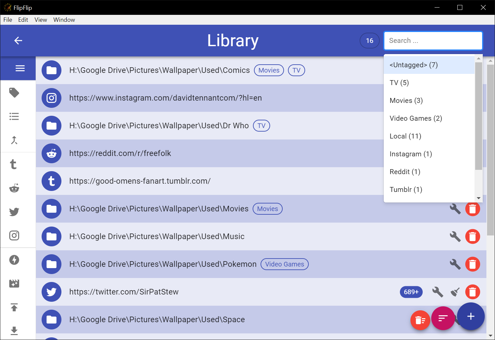

# Library
The **Library** is a place for you to collect and manage all your sources. To access the Library just click `Library`
icon in the Scene Picker (Home) sidebar (  )

## Adding Sources
Sources are added to the Library and sorted just like in a [Scene](sources.md#modifying-sources).

## Search/Filter
Use the search bar to help find or filter the displayed sources. Tags/Types appear with a number indicating how many of 
the displayed sources have that tagvpe.

* Click on the search bar and select a tag, type, `<Offline>`, `<Marked>`, or `<Untagged>`.
  * Start typing to find a particular tag/type.
  * `<Offline>` shows only sources that have been determined to be offline by [Mark Offline](mark_offline.md).
  * `<Marked>` shows only sources that have been [marked](#marking-sources).
  * `<Untagged>` shows only sources which have no tags.
* Type any term and press "Enter" or "Search for ___" to search. This is not case sensitive.
* Type a tag surrounded by "[" and "]" to search by tag.
* Type a type surrounded by "{" and "}" to search by type.
* Type "-" and then any term or filter to _exclude_ those sources.
* Type "count>NUM", "count<NUM", or "count=NUM" to query based on source counts. (Replace "NUM" with a number).
  * This _**excludes**_ counts that are incomplete (still showing "+").
  * To _**include**_ incomplete counts, type "count+>NUM", "count+<NUM", or "count+=NUM".
  
## Marking Sources
Users may wish to visually highlight certain items. To do this, search/filter the displayed sources until they are 
the ones you wish to highlight, and then press **Alt+M**. These sources will be colored green and will remain that 
way after the search/filter is cleared. This may be useful for keeping track of a set of sources you are working on 
(for instance new sources you are tagging). 

## Mark Offline
As your Library grows, it's possible some sources will become unavailable. To aid in detecting this, click the 
`Mark Offline` button (  ) to check your sources. When this process completes, unavailable sources will be marked with 
an offline icon.

## Import Remote Sources
The Library provides the ability to import sources from **Tumblr**, **Reddit**, **Instagram**, and **Twitter**. These
import options will appear in the sidebar after you have authorized the releveant service in [Settings](config.md).
You can only run one import at a time. While a import is running, a progress bar will appear in the sidebar.

?> FlipFlip may become slow while importing sources, but you can feel free to navigate away from the Library. You will
be alerted when your import has completed. 