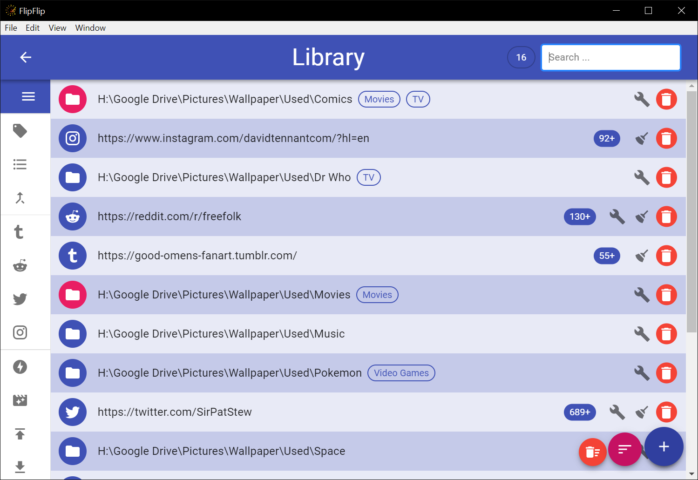

# Library
The **Library** is a place for you to collect and manage all your sources. To access the Library just click `Library` on the Home page.

## Adding Sources
Sources are added to the Library and sorted just like in a [Scene](sources.md#modifying-sources).

## Marking Sources
Users may wish to visually highlight certain items. To do this, search/filter the displayed sources until they are 
the ones you wish to highlight, and then press **Alt+M**. These sources will be colored green and will remain that 
way after the search/filter is cleared. This may be useful for keeping track of a set of sources you are working on 
(for instance new sources you are tagging). 

