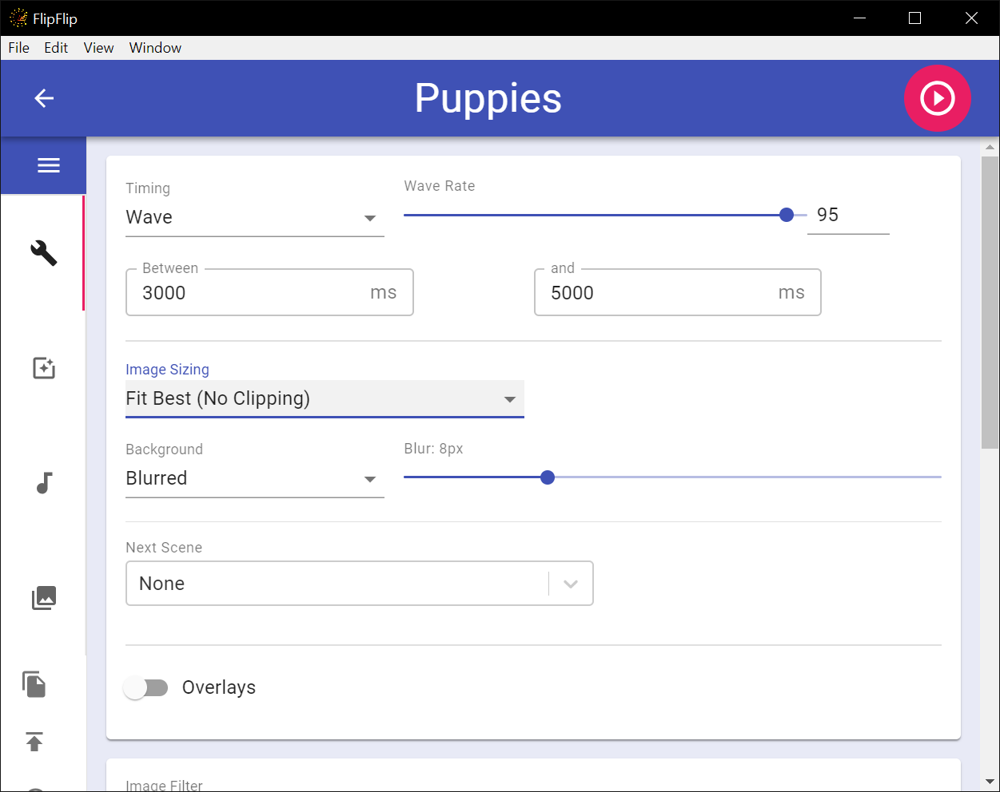
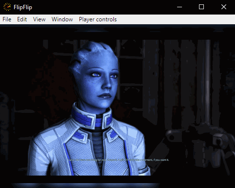
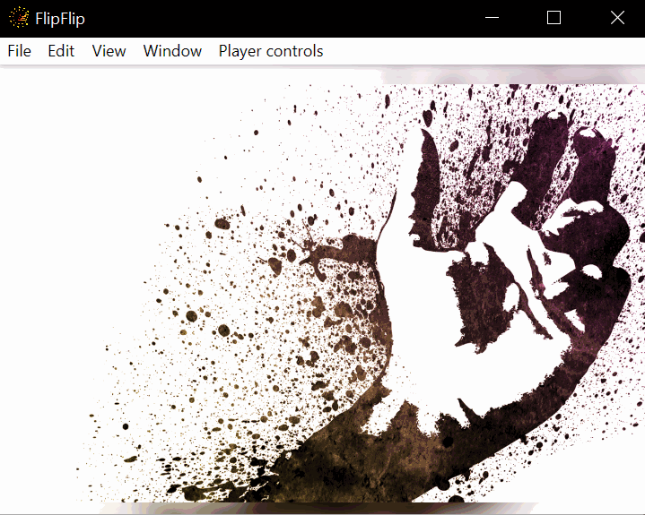

# Options
The **OPTIONS** tab provides a number of ways to control the Scene playback and what images will display. This tab
has two cards: `Scene Options` and `ImageOptions` 

## Scene Options

#### Timing
This setting controls the **rate at which images will change**. The rate can be **constant**, **random**, a **wave**, 
or based on **audio BPM**.
* **Constant**: Changes at a set interval
* **Random**: Changes at a random interval between min & max (ms)
* **Wave**: Changes at sin wave between min & max (ms).
  * You can modify the rate of change as well. _95-100 is generally recommended_ 
* **BPM**: Changes at the rate of the BPM of the first audio file
  * You can change the BPM multiplier to increase/decrease this rate.

_An example of **Wave** timing_

#### Back/Forth
The back/forth feature automatically toggles between the 2 most recent images in a Scene at a set interval. 

_An example of **Back/Forth** every 200ms_

#### Image Sizing
This setting controls the aspect ratio and size of the displayed image:
* **Fit Best (No Clipping)**
* **Fit Best (Clip Edges)**
* **Stretch**
* **Center**
* **Center (No Clipping)**
* **Fit Width**
* **Fit Height**

#### Background
This setting controls the background for this Scene:
* **Blurred** - Control the blur amount
* **Solid Color** - Control the background color
* **Set of Colors** - Control the set of colors. Color will change with each image, in random order.
* **Random Colors** - Color will change with each image.
* **None**

#### Next Scene
Choose a Scene to transition to after this one (or none). Control the timing of the Next Scene (ms)

* **Play After All Images** - Instead of using a fixed time, transition to the Next Scene after all images in this 
  scene have played
  * You can also choose to move to the next scene after an audio clip has ended or after a captioning script has completed.
    You will find these options in the audio and text options, respectively.
* **Persist Audio** - Persist the Audio tracks of this scene through all subsequent Next Scenes
* **Persist Text Overlay** - Persist the Text Overlay scripts of this scene through all subsequent Next Scenes

Rather than picking a single scene, you can select "Random". Click 
to select the scenes you'd like to be randomly picked from.

?> The "Next Scene" will pre-load in the background and start when a configured end condition is met (time, images, audio, text). 
Scene options, effects, audio/text, etc. will also change as configured.

#### Overlay
Add Scene(s)/SceneGrid(s) to overlay over this one (or none). Control each overlay opacity. Layers are rendered in the 
order they are added.

?> Overlaying with another Scene _will not_ show that Scene's Overlays. Overlaying a Scene Grid _will_ show each of 
its Scene's Overlays, but not if they are also a Scene Grid. 

?> There is no limit to the number of scenes you can overlay, but you may experience poor performance if you use too many.

## Image Options

#### Image Filter
This setting controls which images will display:
* **All Images**
* **Only Video**
* **Only Animated** - Videos _and_ Animated GIFs
* **Only Image Files**
* **Only Stills**

#### Image/Video Orientation
These settings allows you to control the orientation of images/videos (respectively).

* **No Change**
* **Only Landscape** - Only display landscape images/videos (width > height)
* **Only Portrait** - Only display portrait images/videos (height > width)
* **Force Landscape** - Force all images/videos to display in landscape (rotates portrait images/videos 90° counter-clockwise)
* **Force Portrait**  - Force all images/videos to display in portrait (rotates landscape images/videos 90° counter-clockwise)

#### Re-Generate On Playback
This option is only available for Scene Generators. When enabled, the scene will be automatically regenerated whenever
playback is started (either directly, or through an overlay/grid).

#### Play Full Sources
By default, FlipFlip will play 1 image from a source before moving to the next. If you would rather play all images of
a source before moving to the next, enable this option.

#### GIF Options
This setting overrides Scene timing specifically for animated GIFs.
* **No Change** 
* **Play Part (Constant)** - Play GIFs for a certain length
* **Play Part (Random)** - Play GIFs for a random length (between min and max)
* **Play At Least** - Play GIFs for at least this length of time (will play full loops until time period has passed)
* **Play Full**

#### Video Options
This setting overrides Scene timing specifically for videos.
* **No Change** 
* **Play Part (Constant)** - Play videos for a certain length
* **Play Part (Random)** - Play videos for a random length (between min and max)
* **Play At Least** - Play videos for at least this length of time (will play full loops until time period has passed)
* **Play Full**

Videos also have a number of other settings:
* **Video Speed** - Choose the playback speed of videos.
* **Random Speed** - Choose to play videos at random speeds and specify the range of speeds.
* **Video Skip Rate** - Choose the rate at which videos skip forward/backwards.
* **Start at Random Time** - Starts videos at a random timestamp (videos start from beginning by default).
* **Continue Videos** - Continue videos from last timestamp during this slideshow (videos restart by default).
* **Use Clips** - Choose to use only [video clips](clips.md) or the entire video.
  * If you are not using video clips, you can choose to skip the first and last parts of each video (ms)
* Control **video volume** for this scene.

#### Weighting
This setting controls how the images are weighted.
* **By source** - each source will be used an even amount (regardless of number of pictures).
* **By image** - each image will be used an even amount (regardless of source).

#### Source Ordering
This setting controls the order sources will be used.
* **Ordered**
* **Randomized**

#### Image Ordering
This setting controls the order images will appear.
* **Strictly Ordered**
* **Ordered**
* **Randomized**

?> Typically, FlipFlip will show images in the order they load. However, *strictly ordered* will force
FlipFlip to wait for the next image to be ready before displaying.

#### Avoid Repeats
When ordering sources/images randomly, enabling this option will ensure all sources/images are used before repeating.