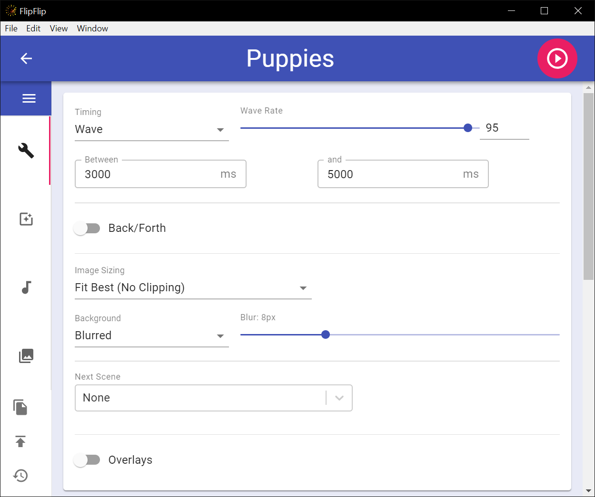

# Options
The **OPTIONS** tab provides a number of ways to control the Scene playback and what images will display. This tab
has two cards: `Scene Options` and `ImageOptions` 

## Scene Options

#### Timing
This setting controls the **rate at which images will change**. The rate can be **constant**, **random**, a **wave**, 
or based on **audio BPM**.
* **Constant**: Changes at a set interval
* **Random**: Changes at a random interval between min & max (ms)
* **Wave**: Changes at sin wave between min & max (ms).
  * You can modify the rate of change as well. _95-100 is generally recommended_ 
* **BPM**: Changes at the rate of the BPM of the first audio file
  * You can change the BPM multiplier to increase/decrease this rate.

_An example of **Wave** timing_
  
#### Image Sizing
This setting controls the aspect ratio and size of the displayed image:
* **Fit Best (No Clipping)**
* **Fit Best (Clip Edges)**
* **Stretch**
* **Center**
* **Fit Width**
* **Fit Height**

#### Background
This setting controls the background for this Scene:
* **Blurred** - Control the blur amount
* **Solid Color** - Control the background color
* **Set of Colors** - Control the set of colors. Color will change with each image, in random order.
* **Random Colors** - Color will change with each image.
* **None**

#### Next Scene
Choose a Scene to transition to after this one (or none). Control the timing of the Next Scene (sec) and if the Next 
Scene should play after all images from the current Scene have played.

Rather than picking a single scene, you can select "Random". Click 
to select the scenes you'd like to be randomly picked from.

You can also choose to move to the next scene after an audio clip has ended or after the captioning script has completed.
You will find these options in the audio and text settings, respectively.

?> The "Next Scene" will pre-load in the background and start when a configured end condition is met (time, images, audio, text). 
Scene options, effects, audio/text, etc. will also change as configured.

#### Overlay
Add Scene(s) to overlay over this one (or none). Control each overlay opacity.

?> There is no limit to the number of scenes you can use with grid/overlay, 
but you may experience poor performance if you use too many.

## Image Options

#### Image Filter
This setting controls which images will display:
* **All Images**
* **Only Video**
* **Only Animated** - Videos _and_ Animated GIFs
* **Only Image Files**
* **Only Stills**

#### Play Full Sources
By default, FlipFlip will play 1 image from a source before moving to the next. If you would rather play all images of
a source before moving to the next, enable this option.

#### GIF Options
This setting overrides Scene timing specifically for animated GIFs.
* **No Change** 
* **Play Part (Constant)** - Play GIFs for a certain length
* **Play Part (Random)** - Play GIFs for a random length (between min and max)
* **Play Full**

#### Video Options
This setting overrides Scene timing specifically for videos.
* **No Change** 
* **Play Part (Constant)** - Play videos for a certain length
* **Play Part (Random)** - Play videos for a random length (between min and max)
* **Play Full**

Videos also have a number of other settings:
* **Video Speed** - Choose the playback speed of videos.
* **Random Speed** - Choose to play videos at random speeds and specify the range of speeds.
* **Start at Random Time** - Starts videos at a random timestamp (videos start from beginning by default).
* **Continue Videos** - Continue videos from last timestamp during this slideshow (videos restart by default).
* **Rotate Portrait Videos** - Rotates any portrait videos 90° to the left (play landscape).
* **Use Clips** - Choose to use only [video clips](clips.md) or the entire video.
  * If you are not using video clips, you can choose to skip the first and last parts of each video (ms)
* Control **video volume** for this scene.

#### Weighting
This setting controls how the images are weighted.
* **By source** - each source will be used an even amount (regardless of number of pictures).
* **By image** - each image will be used an even amount (regardless of source).
  
#### Source Ordering
This setting controls the order sources will be used.
* **Ordered**
* **Randomized**  
  
#### Image Ordering
This setting controls the order images will appear.
* **Strictly Ordered**
* **Ordered**
* **Randomized**

?> Typically, FlipFlip will show images in the order they load. However, *strictly ordered* will force
FlipFlip to wait for the next image to be ready before displaying.

#### Avoid Repeats
When ordering sources/images randomly, enabling this option will ensure all sources/images are used before repeating.