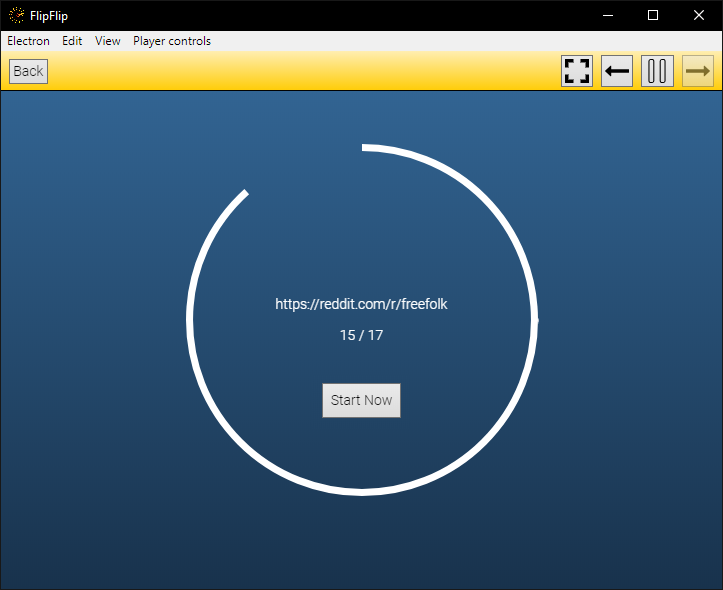
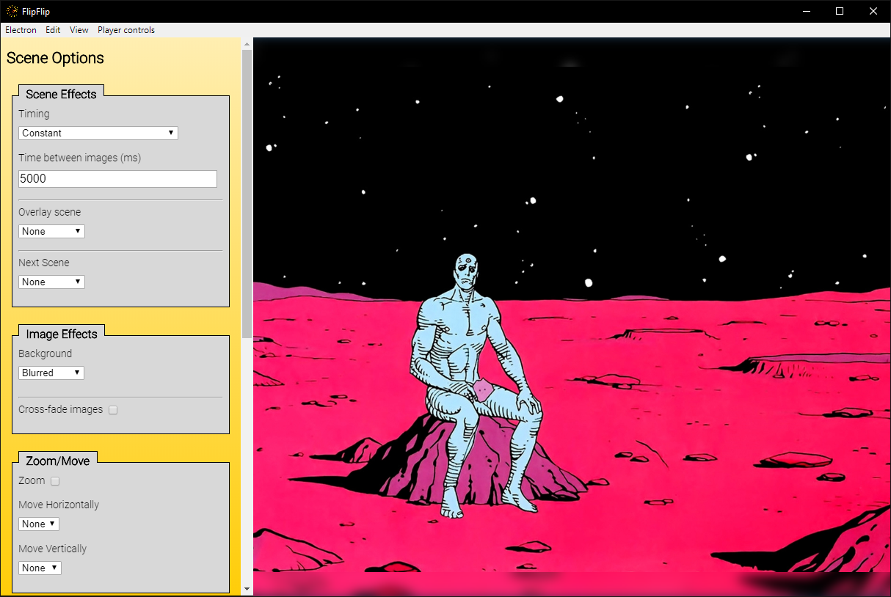
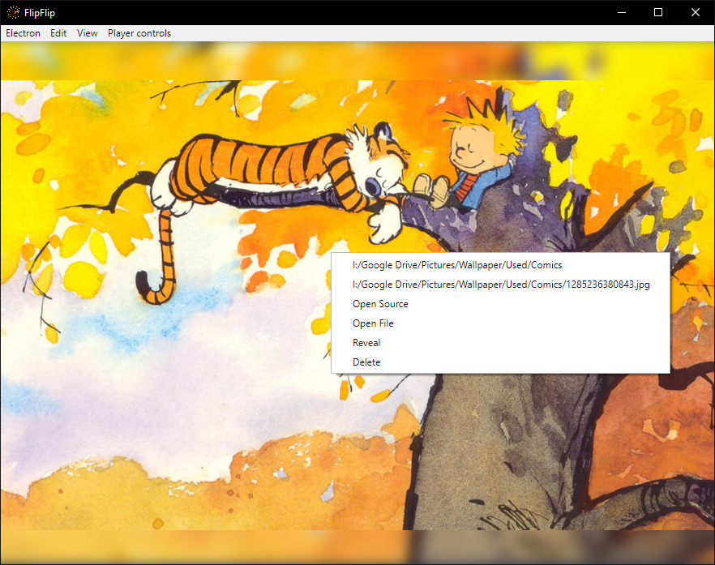
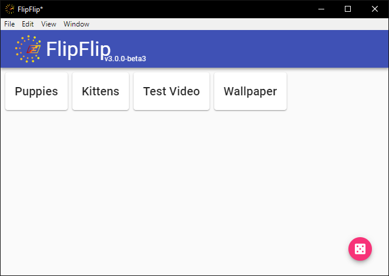

# Playing Your Scene
After you have added at least 1 source and configured your chosen effects, click the `Play` button ( 
 ) to start the show!

## Scene loading
While a Scene (or its overlay) is loading, a progress indicator will display showing the current source being loaded 
and the progress so far. If a Scene finishes loading before its overlay, you will see a separate overlay loading 
indicator as well. When both the Scene and overlay have loaded, the slideshow will begin. 

?> To avoid lag and janky playback, it's recommended to let loading finish, but if you want to start early anyway, 
click `Start Now` when it appears. You can also configure all scenes to start immediately in [Settings](config.md#player-settings).

## Playback controls
All scene options (except the image filter) can also be changed while playing a slideshow by hovering over the sidebar 
on the left. This is also where you will find video/audio playback controls.

## Image info
While a Scene is playing, you can right click on an image to get more information about it.

* The image's source and individual URL are always shown (click to copy to the clipboard).
* Press Ctrl+C or select "Copy Image" to attempt to copy the image itself to the clipboard. 
  * _Image image cannot be copied to clipboard, path will be copied instead_ 
* You can choose to open the source or image directly.
  * _Will use your system's default app for opening that type of link._
* If this image is not from the cache, you can add it to the blacklist for its source.
* If this image is a local file, you are given options to view it in Explorer/Finder or delete it from the system. 
  * _Handy for pruning images you don't want in FlipFlip._ 
* If this image is a remote file and you have enabled caching, a link to the caching directory is also provided.
* If this source is in your Library, "Goto Tag Source" will bring you to Tagging for that source. 
  * _When you click "Back" you will be brought back to the scene that was playing._
* If this  is a video source, "Goto Clip Source" will bring you to Video Clipper for that source. 
  * _When you click "Back" you will be brought back to the scene that was playing._
* Select "Recent Picture Grid" to view a grid of recently played files. 
  * _This will auto-pause playback. Press the back arrow to return to normal playback._

## New Window
To open additional windows for playing scenes, click the `New Window` button ( 
 ) on the home page.
You will be warned that any changes made in this new window will not be saved. Extra windows hide access to the
Library, Preferences, and to adding new scenes. Click a Scene and edit/start as you would usually.

## Player Hotkeys
A number of hotkeys are available for quickly performing user actions. These functions are also available in the menu.
These hotkeys only work for the window in focus.

Use the arrow keys (← / →) to navigate through playback history. Use `Space` to pause/resume playback. 

| Hotkey        | Function                    |
|:-------------:|:---------------------------:|
| Space         | Play/Pause                  |
| ← →           | Navigate History            |
| Shift + Space | Play/Pause Video            |
| Shift + ← →   | Back/Forward N sec of Video |
| Shift + ↑ ↓   | Volume Up/Down              |
| Mouse Wheel   | Volume Up/Down              |
| [ ]           | Navigate Tagging            |
| Esc           | Exit Scene                  |
| Del           | Delete Image                |
| Ctrl+C        | Copy Image/Path             |
| Ctrl+B        | Blacklist File              |
| Ctrl+F        | Toggle Fullscreen           |
| Ctrl+T        | Toggle Always On Top        |
| Ctrl+G        | Toggle Menu Bar             |

?> Note: Video controls only work for main Scene (not Overlays). Scrolling volume control only works while the sidebar is hidden.

