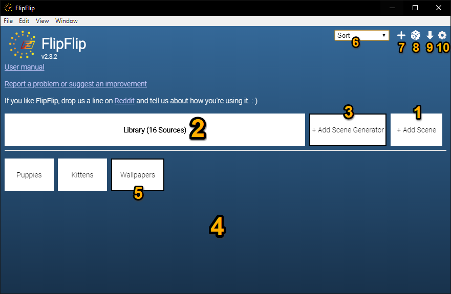
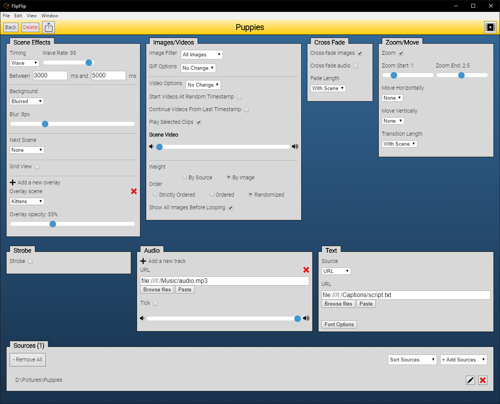

# Getting Started

Download the newest release for your OS [here](https://github.com/ififfy/flipflip/releases/latest). 
No installation necessary, just run `FlipFlip`.  

?> **Mac users**: Right-click the app and pick `Open`. Click through all the dumb prompts until it opens.

## FlipFlip Home

When you first open FlipFlip, you should see a screen like this:

_Note: Some of these features (3 & 7) will be disabled until they are relevant_

1. [Add Scene](scenes.md)
2. [Library](library.md)
3. [Add Scene Generator](scene_generators.md)
4. Your Scenes (Drag'n'drop to manually order)
5. A Scene Generator (bold border)
6. Sort Scenes (Alphabetically ↕️, by Date Added ↕️, by Type)
7. Open Random Scene (Appears when at least 2 Scenes exist)
8. [Import Scene](import_export.md)
9. [Preferences](config.md)

## Your first scene
Let's create a simple scene to get you familiar with how things will work
* Click `+ Add Scene` to create your first scene.
* Give your scene a name.
* In the `Sources` tab, click `+ Add local files`.
* Navigate to a folder with some images you'd like to use and click `Select Folder`.
  * Your selection should now appear in `Sources`.
* Add some effects if you'd like.
  * You can read more about effects [here](effects.md).
* Click the `Play` button (  )

## Your first slideshow
Great! Now your sources have loaded and the slideshow has started!

Video/Audio controls and all scene options (except the image filter) can also be accessed by hovering 
over the sidebar on the left while the slideshow is playing.
                                                      
 

## Navigating image history
Use the arrow keys (← / →) to navigate through playback history. Use `Space` to pause/resume playback. 
These controls are also available in the bar at the top.

 

### When you're done, click Back to return