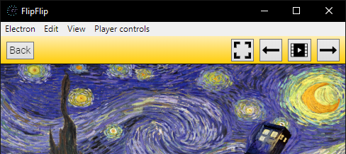

# Getting Started

Download the newest release for your OS [here](https://github.com/ififfy/flipflip/releases/latest). 
No installation necessary, just run `FlipFlip`.  

?> **Mac users**: Right-click the app and pick `Open`. Click through all the dumb prompts until it opens.

## FlipFlip Home

When you first open FlipFlip, you should see a screen like this:

_Note: Some of these features will be disabled until they are relevant_

## Your first scene
The interactive tutorials should guide you through everything you need to know (You can reset these in settings).
However, a short guide to getting started has been provided here as well:

Let's create a simple scene to get you familiar with how things will work.

* From Scene Picker (Home), click the `+` button and then `Add Scene`
* You will be brought to the [Scene Detail](scenes.md) page, and to the [Sources](sources.md) tab
* Click the `+` button and then `Local directory`.
* Navigate to a folder with some images you'd like to use and click `Select Folder`.
  * Your selection should now appear in `Sources`.
* Add some effects if you'd like.
  * You can read more about effects [here](effects.md).
* Click the `Play` button (  )

## Your first slideshow
Great! Now your sources have loaded and the slideshow has started!

Video/Audio controls and all scene options (except the image filter) can also be accessed by hovering 
over the sidebar on the left while the slideshow is playing.

## Navigating image history
Use the arrow keys (← / →) to navigate through playback history. Use `Space` to pause/resume playback. 
These controls are also available in the bar at the top.

### When you're done, click Back to return