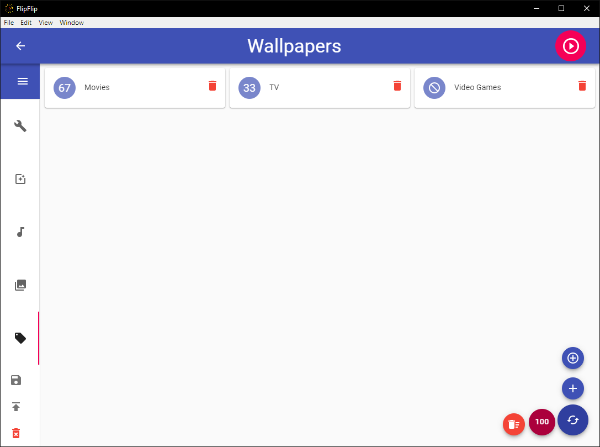
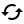
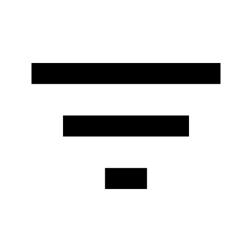

# Scene Generators
**Scene Generators** are a special kind of Scene that uses tag/type/search rules to generate a random list of sources from the Library.

Once you have at least 1 source in the Library, you can add a `Scene Generator` from the Scene Picker (Home). 
Scene Generators appear in their own tab in the Scene Picker.

## Make Rules

### Simple Rules
To get started, click the `+` and select a tag, type, or custom search term to create a **Simple Rule**.

A simple rule can function in 1 of 3 ways:
#### Percent
This will be the most commonly used option. The percent value (modified with the slider) denotes what percentage of the 
total should have the specified tag/type/search.

#### Require
This rule means that all sources _must have_ the specified tag/type/search.

#### Exclude
This rule means that all sources _must **not** have_ the specified tag/type/search.

### Adv Rule
An advanced rule is just a combination of simple rules, which can also be given a **percent**, **require**, or **exclude**.
e.g. You could make an advanced rule made up of 2 simple rules: **require** <Tag1> and **require** <Tag2>. You could then
give this advanced rule a percent of 50. 50% of your generated sources will now have both of these tags!

#### Any
Advance rules can also use the **Any** function. This rule means that all sources _must have **at least one**_ of the specified tags/types/searches 

## Generate Scene
You can't generate a Scene until **all 100%** is allocated between rules. You will see the remaining percent above the
Generate button until your rules are valid. 

Once your rules are valid, click the `Generate` button (  ). This will use the rules you set up to generate a random selection of sources 
for your Scene. The default max number of sources is 100, but you can lower or raise this to meet your needs.

After generating a scene, you will see a number (`X/Y`) next to each Percent rule. This tells you how many sources 
were chosen during generation from the total that fit your rules. This can help in finding an optimal MAX number for your
specific rules.

Any changes to Effects here will be persisted between generated Scenes (using this Generator). The only thing that 
gets overridden when you click `Generate` is the list of sources. If you are particularly fond of a generated 
Scene, you can click `Save as Scene` in the sidebar to save these sources as their own stand-alone Scene.

?> In the options tab, select "Re-Generate on Playback" to automatically regenerate this scene when it is played. This 
includes direct playback, as well as its use in overlays or grids. Scenes with invalid weights will not be re-generated.

?> You can designate tags/types to be globally ignored during generation by visiting the FlipFlip [Settings](config.md) 
menu. By default, new Scene Generators will respect these settings, but you can override this for a particular Generator 
by clicking the `Filter` icon ( 
 ).