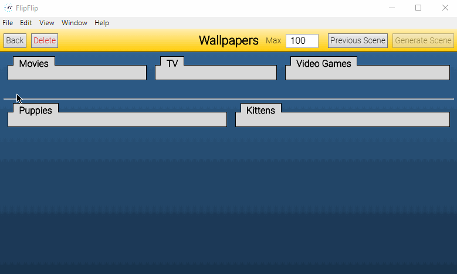

# Scene Generators
**Scene Generators** are a special kind of Scene that uses _weighted_ tags and scenes to generate a random list of 
sources from the Library.

Once you have at least 1 Scene _or_ at least 1 source and 1 tag in the Library, you can click `+ Add Scene Generator` 
on the Home page to make a new Generator.

When you return to the Home page, you will see your new Generator in the list of Scenes. However, Generators are 
distinguished with a **bold** border.

## Weighting

Tags can be weighted in 1 of 3 ways:

#### Weight
This will be the most commonly used option. The weight value (modified with the slider) acts as a ratio for each tag 
in relation to other tag weights. 

?> _Weight is **not** the same as percentage_. The calculated percentage is shown next to the weight to help make results clear.

For example, if 3 tags each have weight 1, the ratio would be `1:1:1` or ~33% each. This would be _the same_ as if 
they were all weighted as 50 (i.e. `50:50:50` == `1:1:1`).

#### Require
This weight means that all sources _must have_ this tag.

#### Exclude
This weight means that all sources _must **not** have_ this tag.

#### Scenes
Scenes can _only_ be weighted (not required/excluded). Other required/excluded tags have no effect on sources from scenes.

## Generate Scene
Once you have weighted each tag/scene to your preference, click `Generate Scene`. This will use the tag & scene 
weights you set up to generate a random selection of sources for your Scene. The default max number of sources is 200, 
but you can lower or raise this to meet your needs.

Any changes to Effects here will be persisted between generated Scenes (using this Generator). The only thing that 
gets overridden when you click `Generate Scene` is the list of sources. If you are particularly fond of a generated 
Scene, you can click `Save as New Scene` to save these sources as their own stand-alone Scene.

Once you have generated a Scene, you can click the `Previous Scene` button on the generator screen to go back to the 
last Scene generated (and not generate new sources).
