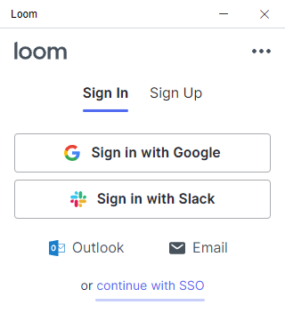
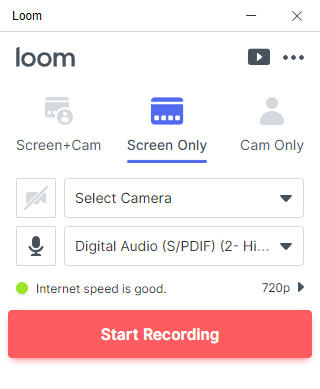
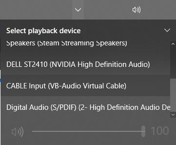
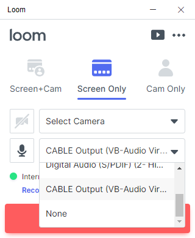

# Screen Capture Tutorial

Many users have requested the ability to record FlipFlip sessions as a video file, to be saved or shared. This 
tutorial will get you started with recording your Scenes. 

Since many excellent free 3rd party tools exist for this purpose, we decided not to try and re-invent them within 
FlipFlip. We recommend using [**Loom**](https://www.loom.com/) and 
[**Virtual Audio Cable**](https://www.vb-audio.com/Cable/) to capture your sessions, but feel free to use whatever 
utilities suit your needs. Both **Loom** and **VirtualAudioCable** are totally free. **Loom** is a nice cross-platform 
screen recording option, and **Virtual Audio Cable** allows us to record FlipFlip (and other) audio. 

?> **Virtual Audio Cable** is only compatible with Windows. However, alternative solutions exist for MacOS and Linux.

### Loom

First, we'll setup [**Loom**](https://www.loom.com/). Before you can start using **Loom**, you'll need to 
[create an account](https://www.loom.com/signup). **Loom** uploads your videos to your account, but these are not made 
publicly visible (unless you do so yourself). However, your profile will be visible on videos you share, so keep that 
in mind when creating it. After you've made an account, you can download and install the 
[desktop app](https://www.loom.com/desktop).

The first time you launch **Loom**, you'll need to sign in (with the account you just created):

Then you'll see the main **Loom** screen:

Unless you want to also record your webcam, we recommend "Screen Only" and disabling the camera input. Next, we'll need 
to send our audio output to a recording channel. This is where **Virtual Audio Cable** comes in.

### Virtual Audio Cable

Now that **Loom** is setup and ready, let's download and setup [**Virtual Audio Cable**](https://www.vb-audio.com/Cable/). 
Click the download button to download the `.zip` package. Then, unzip this package (doesn't matter where). From the 
extracted files, right click on `VBCable_Setup_x64` and click "Run as Administrator". (If you are on a 32-bit system, 
use `VBCable_Setup`). Then, just click the big "Install Driver" button. Windows may prompt you again, just click 
"Install".

That should be it! Click the audio/sound icon in your taskbar then the playback device dropdown. Select the new output 
option "CABLE Input (VB-Audio Virtual Cable)":

This will output all of your system audio to a channel **Loom** can record on.

?> **NOTE**: Be aware that changing your default audio output to "CABLE Input" will result in _all_ of your system
audio being output through that channel. Meaning any other sounds on your computer will also be recorded by **Loom**. 
To prevent this, disable other programs while you're recording, or ensure they are outputting to a different audio 
channel.

### Recording a Scene

Now that we have all the parts setup, let's go back to **Loom** for a minute. Click the Mic dropdown and select the new 
"CABLE Output (VB-Audio Virtual Cable)" option. Now, **Loom** will be able to record the sound coming from FlipFlip!

We're ready to record now. Before we start, get your FlipFlip Scene ready to play. Open up FlipFlip and navigate to the 
Scene you wish to record. Depending on your preference, you may want to start recording before your Scene starts, or 
you may want to wait for your Scene to play for a bit before beginning the recording. For this tutorial, we'll start 
recording before playing the Scene.

So, in **Loom**, click "Start Recording" (the default hotkey to Start/Stop is `Ctrl+Shift+L`). If you have a 
multi-monitor setup, you'll also need to select the monitor to record (whichever FlipFlip is on). You'll see a 3 second 
countdown before recording begins. Once it has, in FlipFlip, click the "Play" button to begin your Scene (be sure to 
expand to fullscreen if you don't want to record the toolbar).

When your Scene has finished, you can stop recording by clicking the **Loom** icon in the taskbar (or by using the 
`Ctrl+Shift+L` hotkey). A webpage should then open and your recording will immediately begin uploading to your Loom 
profile (but not publicly visible). 

You can share the video directly from there, or download it for further editing/clipping. That's all there is to it!

