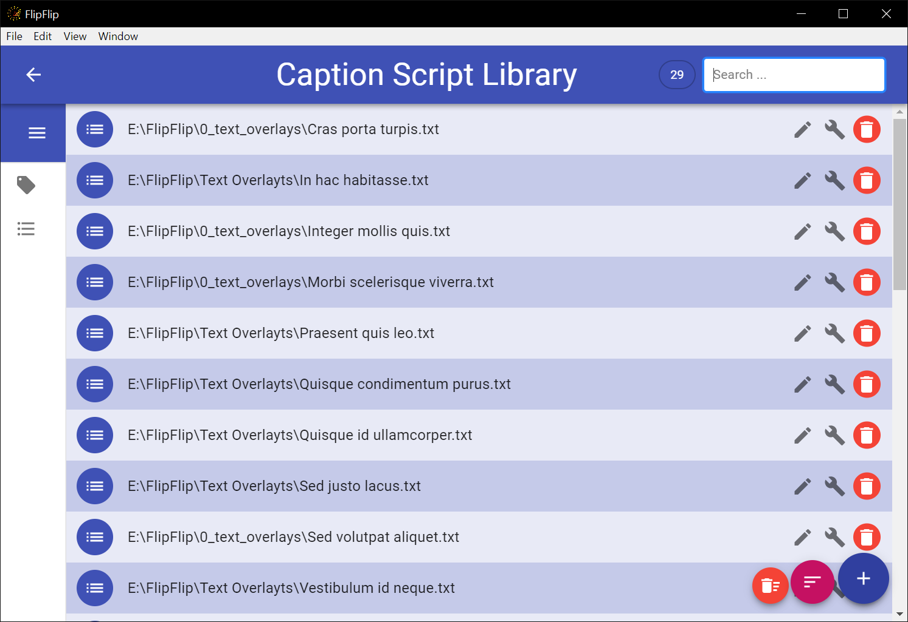

# Library
The **Script Library** is a place for you to collect and manage all your caption scripts. To access the Script Library, 
just click the `Script Library` icon in the Scene Picker (Home) sidebar (  )

## Adding Scripts
You can add scripts by clicking the plus-sign in the bottom right. These can be either local script files, or the URL
of a remote script. This needs to be a plain text file with only the script (e.g. use `raw` URL for Pastebin/Hastebin). You can
also save scripts to your library from the [Scriptor Tool](scriptor.md).

## Search/Filter
Use the search bar to help find or filter the displayed scripts. Tags appear with a number indicating how many of
the displayed scripts have that tag.

* Click on the search bar and select a tag, `<Marked>`, or `<Untagged>`.
    * Start typing to find a particular tag.
    * `<Marked>` shows only scripts that have been [marked](#marking-sources).
    * `<Untagged>` shows only scripts which have no tags.
* Type any term and press "Enter" or "Search for ___" to search. This is not case-sensitive.
* Type a phrase surrounded by `"` and `"` to search that exact phrase.
    * By default -- without this option, FlipFlip splits separate words into separate search terms.
* Type a tag surrounded by `[` and `]` to search by tag.
* Type `-` and then any term or filter to _exclude_ those scripts.

## Marking Sources
Users may wish to visually highlight certain items. To do this, search/filter the displayed scripts until they are
the ones you wish to highlight, and then press **Alt+M**. These scripts will be colored differently and will remain that
way after the search/filter is cleared. This may be useful for keeping track of a set of scripts you are working on.

## Delete Source Content
Sometimes, you may want to be able to totally delete a script from your file system. To do this, **Shift+Ctrl+Alt+Click**
the script's avatar icon. You will be prompted to confirm this choice, after which the script in FlipFlip and the file
on your system will be deleted.

?> **Note**: This can only be done for local scripts