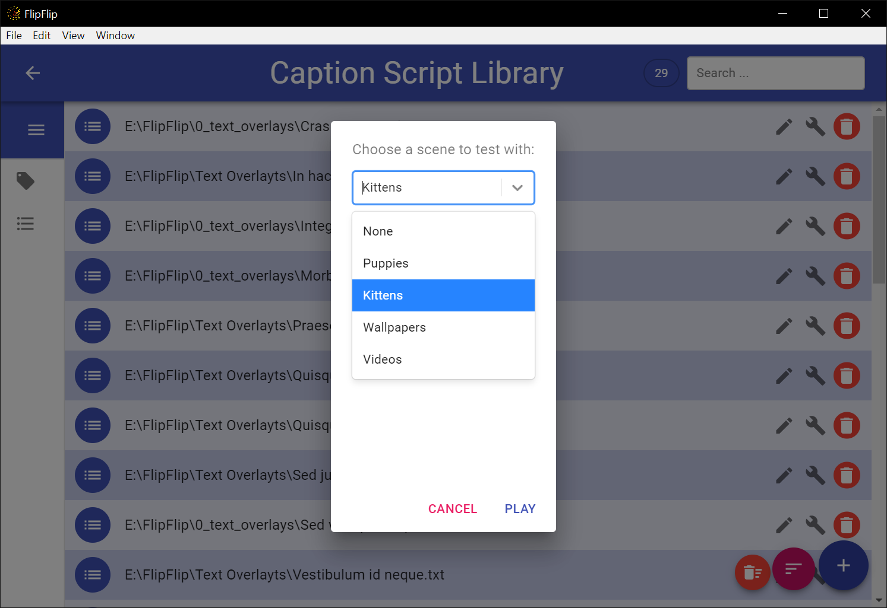

# Tagging
The main power behind the Library (and driving force of [Scene Generators](scene_generators.md)) is the tagging system.

The first step is to add some tags. Click the `Manage Tags` button (  ) in the sidebar. See [Manage Tags](tagging.md#manage-tags)
for more information about adding tags.

?> **Note**: Tags are shared between regular sources, audio tracks, and caption scripts

## Tagging a script
To tag a script in the Library, click the script's Avatar. You will be prompted to select a scene to test this script 
with. After selecting a scene and pressing `PLAY`, the scene and script will start. To modify the tags, hover towards 
the bottom of the screen, and you will see your tags appear. Toggle tags on/off as desired by clicking on them. When 
you're done, click "Back" to return to the Library.

While Tagging, use `[` and `]` to jump to Tagging the previous/next visible script in the Library. It will continue
playing using the same Scene. Return to the library to choose a different scene.

## Batch Tagging

Batch tagging works the same as in the [source Library](tagging.md#batch-tagging).