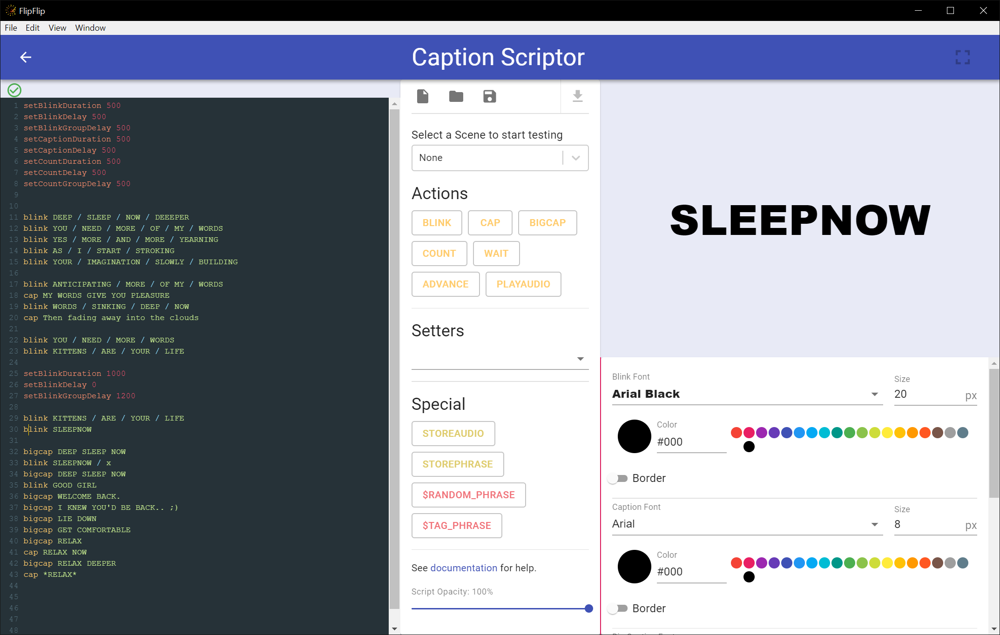

# Caption Scriptor

This tool allows anyone to write, edit, and test caption scripts in real-time! You can save and load from either a 
local file or from your Script Library.

?> All scripts must be in the [caption script format](caption_script.md)

## Code

On the left, is a code panel where you will type/paste your caption script. To assist with coding, your syntax is highlighted according to 
the caption script format. If your code is valid, a green circled-checkmark will appear above the code panel. Otherwise,
this area will print any errors, along with their line number and relevant information.

?> Each change to your script's code will cause playback to restart. 
_TIP: **Click the gutter line numbers to jump to that point in the script**. (Use an audio track to control scripts with timestamps)_

## Menu Buttons & Commands

At the top of the middle column are a number of menu buttons:

*  **New** - Start with a fresh script/fonts
*  **Open** - Open a file
  * **Open File** - Open a file from your local file system
  * **Open From Library** - Import a script from your library (including fonts)
*  **Save** - Save a file
  * **Save** - Save the currently open file to your file system
  * **Save As** - Save the currently open file to your file system, with a new name
  * **Save To Library** - Save a script to your Library (including fonts)
*  **Load From Scene** - Allows you to load any script (and its fonts) from the currently selected Scene

Below these is a dropdown with all of your Scenes. Select a sene from the list to start testing with it. Selecting a 
scene is also the only way you can (1) Load from a Scene, (2) Test with Audio, and (3) Test fullscreen.

### Commands

The middle column is also where you'll find buttons for all of the possible commands in FlipFlip's caption scripts. 
Click a button to insert that command at the code panel's cursor position. See [caption script formatting](caption_script.md)
for help with each command.

At the bottom of this column is a slider you can use to adjust the caption script opacity. This is opacity setting is
global and is additive with any opacity commands in the script.

### Audio

If you have selected a scene which has an audio track, you can click enable "Audio Tracks" to use it while testing your
scene. Currently, you can only use the first track in a Scene. When writing a script with timestamps, you can use audio 
files to control script playback, and jump to particular timestamps.

## Player

The top right corner is where you'll see your script (and Scene) play out in real time. 

?> **Note**: Text sizing and placement is only _approximate_ in this view. Click the "Fullscreen" button in the top 
left to see what your script would _actually_ look like in a Scene.

## Fonts

The bottom right is where you can set the font family, size, and color -- as well as border width and color -- for each 
script command. These are saved with each individual script in the Library.  