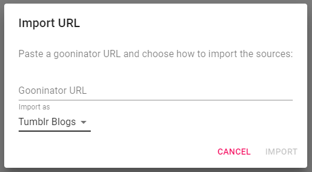

# Sources
**Sources** are the most important part of any Scene. A **source** is a place FlipFlip will find images/videos for 
this Scene. FlipFlip supports sources from (1) Local Directories, (2) A text document with a list of 
image/video URLs, (3) a single video file URL, (4) a single playlsit file URL, or (5) one of the 
[currently supported remote sources](#currently-supported-remote-sources).


* Sources can be ordered Alphabetically (either their full URL or their parsed name), by Date Added, by Count, or by Type.
* Sources can also be manually ordered by drag'n'dropping them.
* A count of usable images/videos will appear next to each source.
  * "**+**" indicates an incomplete count (didn't reach the end, but has _at least_ that many images & videos).
  * Video sources will display the number of clips as their count. You can click this count to toggle clips on/off for a scene.
* Sources can be manually weighted against each other by clicking the  button.
  * This is only available when weighting "By Source"
  * A number will appear next to each source indicating its weight (default: 1);
  * Adjust this number according to your preference (e.g. setting value to 5 is like including that source 5 times in the list).

## Supported filetypes
The following filetypes are supported by FlipFlip:

### Images
* .gif
* .png
* .jpeg / .jpg
* .webp
* .tiff
* .svg

### Videos
* .mp4
* .mkv
* .webm
* .ogv
* .mov (some may not work)

### Playlists
* .asx
* .m3u8
* .pls
* .xspf

## Subtitles
* .vtt

?> While VTT files are not the most common, there are many [online tools](https://subtitletools.com/convert-to-vtt-online) 
which can easily convert more common formats (e.g. SRT, SSA/ASS, SBV, etc.) to WebVTT.

## Modifying sources
#### Adding new source
Click `+` and choose one of the following options:
* Click `URL` to input the URL of a remote source or video/playlist file.
* Click `Local directory` to lookup local directories.
* Click `Local video/playlist` to look up local video files and playlist files
  * **Shift+Click** to recursively import directories of videos
* Click `From Library` to import sources from the Library.
  * For more information about this process see the [Import from Library](import_from_library.md) section.

#### Editing existing source
* To edit a source, click its URL and then make your desired changes. 
  * _Note: Blank and duplicate sources will be automatically removed._
* To see additional options for a source click the 
  * This will only show up for certain types of sources:
  * _**Local** - toggle whether to treat inner directories as if they were their own sources_
  * _**Video** - specify a subtitle file_
  * _**Reddit** - specify feed for subreddits (i.e. "Hot", "Top", "New", etc.)_
  * _**Twitter** - include/exclude retweets and replies_
* To edit the blacklist for a source, click the 
  * _This will only appear for sources which have a blacklist._
  * _To clear the blacklist, **Shift** click the button._
* To clear the cache for a source, click the 
  * _This will only appear if caching is enabled and only for remote sources._
* To select [clips](clips.md) for a source, click the 
  * _This will only appear for video sources._
* To delete a source, click the 

## Source types
#### Local Directory
The simplest way to use FlipFlip is to add a `Local directory` and pick a directory on your computer that contains 
images. FlipFlip will search the entire directory, including subfolders.

#### Image List
If you want to load specific images/videos from the web, you can create a text file containing one URL per line, like this:
```
https://cdn-images-1.medium.com/max/2000/0*vnYtP9N80SQ0pOOD.png
https://cdn-images-1.medium.com/max/2000/0*P1UL5C8Lkyq7wd5P.png
https://cdn-images-1.medium.com/max/2000/0*vnYtP9N80SQ0pOOD.png
```
Then you can either save that file to your computer, or uploaded it to a text file hosting service like 
[Hastebin](https://hastebin.com) if you want to share it with others.

Once you've created this file, add a `URL`. Simply type or paste the path to your raw text file (remote or local).

#### Video/Playlist File
You can add individual video or playlsit files as sources too. These can be either local files or remote files. To add a 
local video/playlist file, add a `Local video/playlsit` and choose the video(s) or playlist(s) you want to add.

?> **NOTE:** _Each video/playlist will be weighted as its own source._

#### Currently Supported Remote Sources

*  Tumblr Blog
*  Reddit Subreddits/Users/Saved
*  Twitter Profile
*  Instagram Profile
*  Imgur Album
*  DeviantArt User
* ImageFap Gallery/Organizer
* Danbooru Tag/User/Pool
* Gelbooru Tag
* E-Hentai Gallery
* Hydrus Tag
* Piwigo Album
* BDSMlr Blog (Only works for blogs with images in RSS feed)
* Nimja Spiral
* Luscious Album/User
* ~~ Sex.com Gallery/User~~ _Currently broken_

#### Gooninator import
If you have some saved links from the beloved, retired web app Gooninator, you can import them into FlipFlip either as 
Tumblr blogs (as they were before) or as local directories (to use your backups).

To access this tool, click in the "Sources" area and then press **Alt+P**. You should then see a popup appear. Paste 
the Gooninator URL, and select whether you'd like to import these sources as Tumblr blogs or Local directories. If you 
choose to import as local directories, you must also configure the directory where you kept your blog backups.

