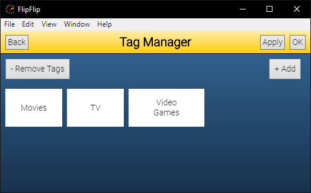
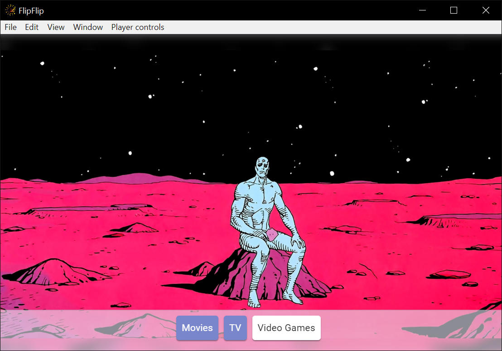
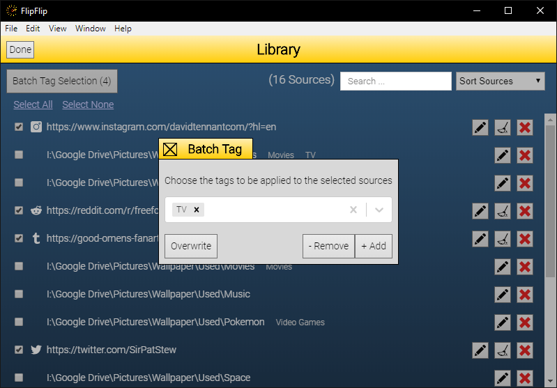

# Tagging
The main power behind the Library (and driving force of [Scene Generators](scene_generators.md)) is the tagging system.

The first step is to add some tags. Click the `Manage Tags` button (  ) in the sidebar.

?> **Note**: Tags are shared between regular sources, audio tracks, and caption scripts

## Manage tags
From this screen, we can add, remove, and re-order our tags as well as manage "tag phrases" (for use in captioning scripts).

* To add a new tag click the `+` and then type the name of the tag and press OK
* To edit a tag's name or "tag-phrases", click the tag.
* To remove a tag, click the tag and then click the . 
* To manually re-order tags, simply drag'n'drop them. (This is the order which they will appear everywhere else).

## Tagging a source
To tag a source in the Library, click the source's Avatar. This will start a Scene with just that source. 
To modify the tags, hover towards the bottom of the screen, and you will see your tags appear. Toggle tags on/off as 
desired by clicking on them. When you're done, click "Back" to return to the Library.

While Tagging, use `[` and `]` to jump to Tagging the previous/next visible source in the Library. 

## Batch Tagging
To begin batch tagging, click the `Batch Tag` button (  ) in the Library sidebar. This will provide a checkbox 
next to each visible source. Select the sources you would like to batch tag and click the `Tag` button 
(  ) in the bottom 
right. You will be presented with a pop-up and a number of options.

* Select tags and click `Overwrite` to force each selected scene to match those tags
* Select tags and click `- Remove` to remove those tags from each selected scene.
* Select tags and click `+ Add` to add those tags to each selected scene.

?> **Tip**: Use the _SHIFT_ key to quickly select multiple sources

