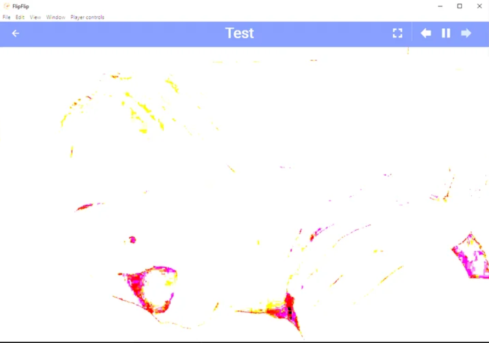

# Troubleshooting

## Video/Images corrupted and complete white-out

**Cause:** The display doesn't support high dynamic range (HDR) content. 
**Solution:** Disable HDR options (Win+Alt+B). 
**More info:** [Microsoft Support](https://support.microsoft.com/en-us/windows/what-is-hdr-in-windows-f5fbf5cb-149d-4a0d-8be1-9ed78c68d3b4)

## FlipFlip data storage location
The FlipFlip data storage location is different for each operating system:
| <!-- -->      | <!-- -->                                 |
| ------------- | -----------------------------------------|
| Windows       | `%APPDATA%/flipflip`                     |
| MacOS         | `~/Library/Application Support/flipflip` |
| Linux         | `~/.config/flipflip`                     |

The `data.json` file is the latest config. Other `data-*.json` files with a timestamp are backups. 